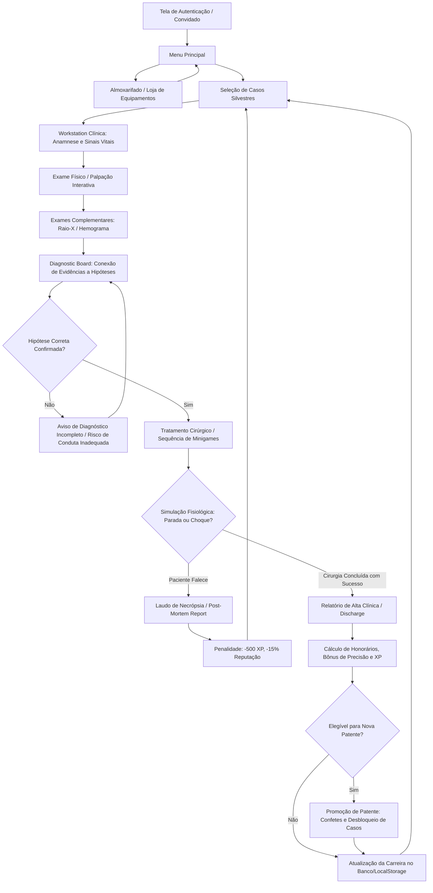

# MEDZOO — MASTER CONTEXT & AUDITORIA TÉCNICA DO PROJETO

> **DOCUMENTO DE ENGENHARIA REVERSA E AUDITORIA COMPLETA DE SISTEMAS**  
> **Data de Conclusão da Auditoria:** 21 de Setembro de 2026  
> **Escopo Auditado:** `/home/melooz/Documentos/Medzoo/webapp` e comparação forense com `/home/melooz/Documentos/medzoo-final`  
> **Status do Código:** 100% Intocado (Auditoria exclusivamente analítica / Read-Only). Nenhuma linha de código de produção foi modificada.

---

## LEGENDA DE CLASSIFICAÇÃO RIGOROSA
Nenhum dado neste documento baseia-se em suposições desinformadas ou promessas de documentação antiga. Cada declaração relevante está marcada conforme:
- `[CONFIRMADO NO CÓDIGO]` — Verificado diretamente na sintaxe, chamadas e estruturas de arquivos existentes.
- `[INFERIDO POR PADRÃO/ARQUITETURA]` — Conclusão lógica derivada do encadeamento de padrões e convenções de código implementadas.
- `[NÃO CONFIRMADO / AUSENTE NO CÓDIGO]` — Funcionalidade mencionada em comentários, tipos ou nomes de arquivo, mas ausente ou desconectada da execução real.

---

## 1. VISÃO GERAL DO JOGO

### 1.1 Proposta e Tema
O **MedZoo** é um simulador médico-veterinário interativo voltado para a rotina de emergência, diagnóstico e intervenção cirúrgica em animais silvestres e exóticos da fauna brasileira (e neotropical). O jogador atua como médico veterinário de plantão em um hospital de fauna selvagem, recebendo casos que variam desde aves com fraturas e intoxicações aguda por metais pesados até répteis com queimaduras e distocias, e mamíferos de grande porte com fraturas cominutivas ou lacerações profundas.
`[CONFIRMADO NO CÓDIGO: webapp/src/data/cases.ts:3-802]`

### 1.2 Tom Clínico-Educativo
O jogo adota rigor técnico-científico veterinário formal: exames físicos utilizam terminologia semiológica precisa (*ranfoteca, celoma, inglúvio, crepitação óssea, hipotermia, bradicardia*); a farmacologia é baseada em fórmulas de cálculo real de dose por quilograma corpóreo com base no peso real da espécie; e as cirurgias exigem instrumentos hospitalares autênticos (*afastador Gelpi, pinça Halsted-Mosquito, porta-agulhas Mayo-Hegar, pinos de Steinmann, placas bloqueadas LCP*).
`[CONFIRMADO NO CÓDIGO: webapp/src/data/pharmacology.ts:1-177, webapp/src/components/minigames/TreatmentMinigame.tsx:66-86]`

### 1.3 Stack Tecnológica Completa
- **Linguagem Principal:** TypeScript ~6.0.2 configurado em modo estrito (`tsconfig.json` e `tsconfig.app.json`).
- **Biblioteca de UI:** React 19 (`react` 19.2.8, `react-dom` 19.2.8).
- **Bundler & Build Tool:** Vite 5.4.11 com `@vitejs/plugin-react` 4.3.3.
- **Estilização:** Tailwind CSS 4.3.3 utilizando `@tailwindcss/vite` com tema customizado para estética hospitalar/diegetica escura (tons de esmeralda, âmbar e ardósia).
- **Backend / Nuvem:** Supabase Client 2.116.0 (`@supabase/supabase-js`) para autenticação de usuários e persistência remota da tabela `career_progress`.
- **Animações:** Framer Motion 13.1.1 para transições de tela, janelas modais e painéis suspensos.
- **Ícones:** Lucide React 1.38.0.
- **Efeitos Visuais:** Canvas-confetti 1.9.4 para celebrações de promoção de patente clínica.
- **Áudio:** Web Audio API nativa do navegador (`AudioContext`), dispensando totalmente arquivos de áudio estáticos `.mp3` ou `.wav`.
- **Linter:** Oxlint 1.79.0.
`[CONFIRMADO NO CÓDIGO: webapp/package.json:1-33]`

### 1.4 Estado Atual de Maturação
O projeto encontra-se em estado funcional como Single Page Application (SPA) para navegadores modernos. Não há backend Node/Express proprietário: toda a lógica de gameplay, simulação fisiológica e cálculo farmacológico roda no cliente (client-side), comunicando-se com o Supabase para auth e persistência de carreira, dispondo de suporte resiliente a modo Offline/Convidado via `localStorage` e `sessionStorage`.
`[CONFIRMADO NO CÓDIGO: webapp/src/App.tsx:28-130, webapp/src/lib/db.ts:14-116]`

---

## 2. LOOP PRINCIPAL DE GAMEPLAY

O fluxo de jogo é projetado em torno de um ciclo contínuo de atendimento ambulatorial e hospitalar:



### Fases do Loop Detalhadas:
1. **Recepção do Caso:** O jogador escolhe um paciente disponível na lista (`CaseSelect.tsx`). O acesso a casos avançados depende do Rank do jogador.
2. **Estação de Trabalho Clínica (`ClinicWorkstation.tsx`):** Exibe a identificação zoológica, histórico de resgate, orçamento do caso e monitor multiparamétrico de sinais vitais com renderização em tempo real de ECG.
3. **Coleta de Evidências:**
   - *Anamnese:* Evidência histórica coletada ao ler o prontuário (`ev_anamnese`).
   - *Exame Físico (`PalpationMinigame.tsx`):* Investigação táctil das regiões corporais sobre a imagem real da espécie.
   - *Exames Complementares (`XRayMinigame.tsx`, `HemogramMinigame.tsx`):* Custam parte do orçamento do caso e geram evidências críticas (`ev_img`, `ev_hemo`).
4. **Consolidação Diagnóstica (`DiagnosticBoardMinigame.tsx`):** O jogador conecta as evidências encontradas às 3 hipóteses diferenciais do caso até isolar e confirmar a etiologia correta.
5. **Intervenção Cirúrgica (`TreatmentMinigame.tsx`):** Execução ordenada do grafo de etapas operatórias (`treatmentSequence`), manipulando instrumentos reais contra o relógio e mantendo a estabilidade hemodinâmica do animal sob anestesia.
6. **Desfecho Clínico:**
   - *Alta (`ClinicalDischargeReport.tsx`):* Paciente sobrevive; o saldo restante do orçamento reverte para os cofres do hospital somado ao bônus de estrelas.
   - *Óbito (`PostMortemReport.tsx`):* Paciente entra em colapso; jogador sofre penalidade de confiabilidade (-15%) e experiência (-500 XP).
`[CONFIRMADO NO CÓDIGO: webapp/src/App.tsx:143-225, webapp/src/components/ClinicWorkstation.tsx:50-320]`

---

## 3. ARQUITETURA DE CÓDIGO E PASTAS

```
webapp/
├── index.html                   # Entry point HTML com fontes e montagem do root
├── package.json                 # Manifesto de dependências e scripts Vite/Oxlint
├── tsconfig.json                # Configuração TypeScript de referências de projeto
├── tsconfig.app.json            # Configuração estrita do compilador TS para src/
├── tsconfig.node.json           # Configuração TS para scripts Vite
├── vite.config.ts               # Bundler Vite com React plugin e base path './'
├── public/
│   └── assets/
│       ├── animals/             # 20 fotografias de animais clínicos reais (c1 a c20) + test.txt
│       ├── background/          # clinic_bg.png + .gitkeep
│       ├── backgrounds/         # clinic_bg.png (DUPLICATA de diretório por caminhos legados)
│       ├── photos/              # 13 fotos animais de versão legada (NÃO UTILIZADAS)
│       └── xrays/               # 8 SVGs técnicos de radiografia (xray_avian_wing, etc.)
└── src/
    ├── main.tsx                 # Ponto de montagem React no DOM com StrictMode
    ├── App.tsx                  # Gerenciador global de tela, carreira, autenticação e modais
    ├── types/
    │   └── index.ts             # Tipagem TypeScript de Casos, Vitais, Cirurgia e Upgrades
    ├── lib/
    │   ├── supabase.ts          # Cliente Supabase singleton inicializado
    │   └── db.ts                # Operações CRUD para a tabela career_progress no Supabase
    ├── data/
    │   ├── cases.ts             # Registro canônico dos 20 casos clínicos completos (CASE_REGISTRY)
    │   ├── pharmacology.ts      # Vade-mécum com 5 frascos, doses por espécie e contraindicações
    │   └── upgrades.ts          # Catálogo de 9 equipamentos cirúrgicos/hospitalares da loja
    ├── utils/
    │   ├── assetHelper.ts       # Resolução de URLs públicas e sanitização anti-file:///
    │   ├── PerformanceMonitor.tsx # Monitor de framerate (Órfão na árvore principal)
    │   ├── physiologyEngine.ts  # Motor matemático de simulação hemodinâmica e vitais
    │   ├── sound.ts             # Motor procedural Web Audio API (SoundEngine singleton)
    │   ├── surgicalCaseValidator.ts # Validador formal estático de integridade de casos
    │   └── surgicalStepEngine.ts # Motor funcional de transição e ativação de passos cirúrgicos
    └── components/
        ├── AuthScreen.tsx       # Autenticação Supabase (Login, Cadastro e Convidado)
        ├── CaseSelect.tsx       # Grade de seleção dos 20 casos com filtros por patente
        ├── ClinicWorkstation.tsx# Dashboard principal do atendimento clínico ambulatorial
        ├── ClinicalDischargeReport.tsx # Relatório formal de alta médica e remuneração
        ├── PostMortemReport.tsx # Laudo de necrópsia com dedução de causa mortis e penalidades
        ├── HospitalShopModal.tsx# Almoxarifado de compra de instrumentais veterinários
        ├── Navbar.tsx           # Barra superior de navegação com status financeiro e plantão
        ├── SettingsModal.tsx    # Modal de controle de volume sonoro, perfil e encerramento
        └── minigames/
            ├── DiagnosticBoardMinigame.tsx # Quadro investigativo de evidências e hipóteses
            ├── HemogramMinigame.tsx        # Leitor microscópico de contagem celular sanguínea
            ├── PalpationMinigame.tsx       # Exame tátil interativo com mapa de dor
            ├── PharmacologyMinigame.tsx    # Cálculo e seringa para infusão de fármacos
            ├── TreatmentMinigame.tsx       # Orquestrador da mesa cirúrgica e passos operatórios
            ├── UltrasoundMinigame.tsx      # Simulador de ultrassonografia 2D com Doppler BART
            ├── XRayMinigame.tsx            # Negatoscópio digital para radiografias
            └── surgeries/
                ├── AnestheticInductionMinigame.tsx # Indução inalatória (0 usos em casos)
                ├── BoneDrillMinigame.tsx          # Perfurador ortopédico com motor de torque
                ├── EndoscopyMinigame.tsx          # Trator endoscópico para corpos estranhos
                ├── EpoxyResinMinigame.tsx         # Reconstrução com resina epóxi bicomponente
                ├── FractureReductionMinigame.tsx  # Alinhamento ósseo manual (0 usos em casos)
                ├── HemostasisMinigame.tsx         # Termocoagulação bipolar (0 usos em casos)
                ├── LcpPlatingMinigame.tsx          # Fixação de placa LCP bloqueada (0 usos em casos)
                ├── OrthopedicDrillMinigame.tsx    # [DEAD CODE] Versão legada não importada
                ├── OrthopedicPinsMinigame.tsx     # Inserção de pinos intramedulares de Steinmann
                ├── ResinThermodynamicsMinigame.tsx# [DEAD CODE] Versão legada não importada
                ├── SoftTissueIncisionMinigame.tsx # Incisão com bisturi e traçado de corte
                ├── SutureTensionMinigame.tsx      # Síntese tecidual com controle de tensão de fio
                ├── SyringeIrrigationMinigame.tsx  # Lavagem e desbridamento com seringa salina
                └── WoundDressingMinigame.tsx      # Aplicação de curativo e bandagens multicamadas
```
`[CONFIRMADO NO CÓDIGO: filesystem scan completo em webapp/]`

---

## 4. ESTADO GLOBAL E SINCRONIZAÇÃO

### 4.1 Arquitetura sem Bibliotecas Externas de Store
O MedZoo não utiliza Redux, Zustand ou Context API para o estado global. Toda a reatividade de alto nível é orquestrada em `App.tsx` via `useState` e propagada para os componentes filhos via props:
- `careerState: CareerState` — Mantém `money`, `reliability`, `shiftMinutes`, `xp`, `rank`, `completedCaseIds` e `unlockedUpgrades`.
- `selectedCase: CaseData | null` — O caso clínico atualmente carregado.
- `view: 'auth' | 'menu' | 'case_select' | 'clinic'` — A tela ativa na máquina de estados.
- `userId: string | null` — Identificador do usuário autenticado no Supabase (ou `null` no modo Convidado).
`[CONFIRMADO NO CÓDIGO: webapp/src/App.tsx:28-40]`

### 4.2 Sincronização e Ciclos de Persistência
1. **Carregamento Inicial (`App.tsx:43-102`):** No `useEffect` de montagem, é verificado o Supabase Auth. Se autenticado, chama `fetchCareer(session.user.id)` em `lib/db.ts`, preenchendo o `careerState`. Caso não haja sessão, tenta carregar o `localStorage.getItem('medzoo_career')`.
2. **Auto-Save com Debounce (`App.tsx:105-113`):** Qualquer alteração em `careerState` dispara um timer de 1.000 ms que grava no Supabase via `saveCareer(userId, careerState)`.
3. **Fallback Offline Imediato (`App.tsx:116-118`):** Sincronamente com qualquer mutação do estado de carreira, `localStorage.setItem('medzoo_career', JSON.stringify(careerState))` é chamado.
4. **Persistência de Sessão da Workstation (`ClinicWorkstation.tsx:125-137`):** Durante o atendimento de um caso, o estado ambulatorial é salvo em `sessionStorage` com a chave `medzoo_clinic_v3_${caseData.id}`, permitindo recarregar a página sem perder exames já realizados ou fármacos administrados.
5. **Persistência de Sessão Cirúrgica (`TreatmentMinigame.tsx:107-133`):** Os passos cirúrgicos e seus status (`pending`, `active`, `completed`) são preservados em `sessionStorage` na chave `medzoo_steps_v3_${caseData.id}`.
`[CONFIRMADO NO CÓDIGO: webapp/src/App.tsx:105-118, webapp/src/components/ClinicWorkstation.tsx:125-137, webapp/src/components/minigames/TreatmentMinigame.tsx:107-133]`

### 4.3 Isolamento da Simulação Fisiológica (ECG e Vitais)
Para evitar que atualizações a cada 250 ms em sinais vitais disparem re-renderizações em cascata de toda a interface, `ClinicWorkstation.tsx` utiliza `vitalsRef = useRef<VitalsParameters | null>(null)` e atualiza o estado local `setVitals` em lotes com `requestAnimationFrame` desacoplado da árvore de UI.
`[CONFIRMADO NO CÓDIGO: webapp/src/components/ClinicWorkstation.tsx:139-200]`

---

## 5. NAVEGAÇÃO E MÁQUINA DE ESTADOS DE TELAS

A navegação da aplicação é controlada pela variável `view` em `App.tsx`:

| View | Componente Principal | Condição de Entrada | Transições Permitidas |
| :--- | :--- | :--- | :--- |
| `'auth'` | `<AuthScreen />` | Usuário deslogado sem perfil guest ativo | -> `'menu'`, -> `'case_select'` |
| `'menu'` | `<MainMenu />` | Início ou clique em 'Início' na Navbar | -> `'case_select'`, abre `<HospitalShopModal />` |
| `'case_select'` | `<CaseSelect />` | Clique em 'Atender Casos' ou término de caso | -> `'clinic'` (ao selecionar caso) |
| `'clinic'` | `<ClinicWorkstation />` | Caso selecionado em `CaseSelect` | -> `'case_select'` (ao abandonar ou finalizar) |

### Guardas de Rota Implementadas
- **Guarda de Caso Nulo (`App.tsx:133-137`):** Se `view === 'clinic'`, mas `selectedCase === null`, o sistema redireciona imediatamente para `case_select`.
- **Guarda de Autenticação (`App.tsx:231`):** A barra de navegação global (`Navbar`) só é renderizada quando `view !== 'auth'`.
- **Desfechos no Fluxo Clínico:** `ClinicWorkstation` controla internamente telas de sobreposição (Overlays):
  - `activeMinigame`: quando não nulo, sobrepõe o dashboard clínico com o minigame ativo.
  - `caseFinished`: renderiza `<ClinicalDischargeReport />` se o paciente sobreviveu, ou `<PostMortemReport />` se `isDead === true`.
`[CONFIRMADO NO CÓDIGO: webapp/src/App.tsx:133-255, webapp/src/components/ClinicWorkstation.tsx:795-880]`

---

## 6. DADOS DOS CASOS CLÍNICOS (REGISTRO CANÔNICO DOS 20 CASOS)

O arquivo `webapp/src/data/cases.ts` contém o array `CASE_REGISTRY: CaseData[]` com exatamente 20 casos clínicos distribuídos em 4 patentes veterinárias.
`[CONFIRMADO NO CÓDIGO: webapp/src/data/cases.ts:3-802]`

### 6.1 Tabela Geral Resumo dos 20 Casos

| ID | Código | Espécie | Nome Científico | Categoria / Rank | Orçamento | Diagnóstico Correto | Exames Disp. | Etapas Cirúrgicas | Minigames Cirúrgicos |
| :--- | :--- | :--- | :--- | :--- | :--- | :--- | :--- | :--- | :--- |
| `c1` | `CB-01` | **Coruja-buraqueira** | *Athene cunicularia* | Estagiário | R$ 800 | Laceração Alar com Fratura de Rádio-Ulna | rx_01, hemo | 2 | SyringeIrrigation, SutureTension |
| `c2` | `JP-02` | **Jabuti-piranga** | *Chelonoidis carbonarius* | Estagiário | R$ 600 | Fratura Traumática de Plastrão sem Evisceração | Nenhum | 2 | SyringeIrrigation, EpoxyResin |
| `c3` | `AC-03` | **Arara-canindé** | *Ara ararauna* | Estagiário | R$ 1200 | Intoxicação Aguda por Metais Pesados (Zinco/Chumbo) | hemo | 1 | SyringeIrrigation |
| `c4` | `SA-04` | **Sucuri-amarela** | *Eunectes notaeus* | Estagiário | R$ 950 | Estomatite Infecciosa Necrótica Ulcerativa Severa | hemo | 1 | SyringeIrrigation |
| `c5` | `HA-05` | **Harpia** | *Harpia harpyja* | Residente | R$ 2500 | Fratura Longitudinal de Ranfoteca com Exposição Vascular | Nenhum | 1 | EpoxyResin |
| `c6` | `OP-06` | **Onça-pintada** | *Panthera onca* | Residente | R$ 4000 | Fratura Cominutiva Instável de Fêmur | rx_01 | 3 | BoneDrill, OrthopedicPins, SutureTension |
| `c7` | `TB-07` | **Tamanduá-bandeira** | *Myrmecophaga tridactyla* | Residente | R$ 3200 | Fratura Oblíqua Completa de Fêmur por Atropelamento | rx_01 | 2 | BoneDrill, OrthopedicPins |
| `c8` | `LG-08` | **Lobo-guará** | *Chrysocyon brachyurus* | Residente | R$ 1800 | Ferida Contusa Infectada por Mordedura com Celulite | hemo | 2 | SyringeIrrigation, SutureTension |
| `c9` | `TT-09` | **Tucano-toco** | *Ramphastos toco* | Residente | R$ 1500 | Fratura Parcial de Ranfoteca com Exposição Trabecular | Nenhum | 1 | EpoxyResin |
| `c10` | `BP-10` | **Bicho-preguiça** | *Bradypus variegatus* | Residente | R$ 2200 | Queimadura Eletrotérmica Acral de 3º Grau | Nenhum | 2 | SyringeIrrigation, WoundDressing |
| `c11` | `JP-11` | **Jacaré-do-pantanal** | *Caiman yacare* | Especialista | R$ 2800 | Ingestão de Corpo Estranho Metálico (Anzol de Pesca) | rx_01 | 1 | Endoscopy |
| `c12` | `JG-12` | **Jaguatirica** | *Leopardus pardalis* | Especialista | R$ 3100 | Obstrução Gastrointestinal por Corpo Estranho Mineralizado | rx_01, hemo | 2 | Endoscopy, SutureTension |
| `c13` | `CA-13` | **Capivara** | *Hydrochoerus hydrochaeris* | Especialista | R$ 1500 | Miíase Cutânea Traumática com Infecção Bacteriana Secundária | hemo | 2 | SyringeIrrigation, WoundDressing |
| `c14` | `MP-14` | **Macaco-prego** | *Sapajus apella* | Especialista | R$ 3600 | Traumatismo Cranioencefálico Leve com Laceração Cutânea | Nenhum | 2 | SyringeIrrigation, SutureTension |
| `c15` | `IV-15` | **Iguana-verde** | *Iguana iguana* | Especialista | R$ 1400 | Abscesso Mandibular Caseoso Subcutâneo | Nenhum | 2 | SoftTissueIncision, SyringeIrrigation |
| `c16` | `TE-16` | **Teiú** | *Salvator merianae* | Chefe de Clínica | R$ 2600 | Distocia Celomática Obstrutiva por Retenção de Ovos | rx_01 | 2 | SoftTissueIncision, SutureTension |
| `c17` | `CM-17` | **Cachorro-do-mato** | *Cerdocyon thous* | Chefe de Clínica | R$ 4500 | Fratura Transversa de Tíbia e Fíbula por Aprisionamento | rx_01 | 3 | BoneDrill, OrthopedicPins, SutureTension |
| `c18` | `JC-18` | **Jiboia-constritora** | *Boa constrictor* | Chefe de Clínica | R$ 1800 | Queimadura Térmica por Contato de 2º Grau em Ventre | Nenhum | 2 | SyringeIrrigation, WoundDressing |
| `c19` | `ST-19` | **Sagui-de-tufo-branco** | *Callithrix jacchus* | Chefe de Clínica | R$ 4200 | Fratura Diafisária Fechada de Rádio e Ulna com Desvio | rx_01 | 2 | BoneDrill, OrthopedicPins |
| `c20` | `AN-20` | **Anta** | *Tapirus terrestris* | Chefe de Clínica | R$ 5500 | Laceração Abdominal Extensa com Preservação Peritoneal | Nenhum | 3 | SyringeIrrigation, SutureTension, WoundDressing |

---

### 6.2 Fichas Clínicas Detalhadas de Cada Caso

#### Caso C1: Coruja-buraqueira (*Athene cunicularia*)
- **Código do Paciente:** `CB-01`
- **Motivo de Chegada:** Laceração de asa
- **Patente Mínima:** `Estagiário`
- **Orçamento Disponível:** R$ 800
- **Peso Corporal:** 0.15 kg
- **Urgência:** NÃO
- **Imagem do Paciente:** `/assets/animals/c1_coruja_buraqueira.jpg`
- **Histórico:** *"Paciente admitido na emergência apresentando laceração de asa. Necessita de avaliação clínica e conduta terapêutica imediata."*
- **Sinais Vitais Iniciais:** Temp: `40.2°C` | FC: `Taquicardia (280 bpm)` | FR: `Taquipneia` | TPC: `>2s` | Mucosas: `Hipocorada`
- **Exame Físico / Zonas de Palpação:**
  - **Asa Esquerda (Lesão)** (Região: `limbs`, Pino: `x=38%, y=54%`): Sensibilidade local elevada e laceração alar profunda com crepitação. *(Custo: 20 estresse, 10s)* [Gera: `ev_fisico`]
  - **Cabeça / Olhos** (Região: `head`, Pino: `x=52%, y=22%`): Sinais de dor aguda e estresse álgico intenso. *(Custo: 10 estresse, 5s)* [Gera: `ev_fisico`]
  - **Tórax / Peito** (Região: `body`, Pino: `x=54%, y=48%`): Penas desordenadas e hematoma torácico leve superficial. *(Custo: 15 estresse, 10s)* [Gera: `nenhuma`]
- **Exames Complementares Registrados:**
  - **Radiografia Digital** (`xray`): Custo R$ 150. Imagem: `/assets/xrays/xray_avian_wing_c1.svg`. Hotspot: `x=50%, y=50%, raio=20%`. Gera: `ev_img`
  - **Hemograma Laboratorial:** Disponível (ev_hemo presente: *"Leucocitose com heterofilia reativa a trauma"*).
- **Hipóteses Diagnósticas no Board:**
  - `h1`: ✅ **CORRETA** — **Laceração Alar com Fratura de Rádio-Ulna** | Evidências Requeridas: `['ev_fisico', 'ev_img']` | Descrição: *Ruptura dérmico-muscular extensa associada a fratura diafisária alar por impacto.*
  - `h2`: ❌ *Diferencial* — **Fratura Exposta Cominutiva de Úmero** | Evidências Requeridas: `['ev_fisico']` | Descrição: *Fratura umeral proximal com múltiplos estilhaços ósseos penetrantes.*
  - `h3`: ❌ *Diferencial* — **Luxação Glenoumeral Traumática sem Fratura** | Evidências Requeridas: `['ev_fisico']` | Descrição: *Deslocamento articular da cintura escapular com integridade óssea apendicular.*
- **Opções de Conduta / Tratamento:**
  - `t_correct` (✅ Adequado): Conduta Cirúrgica Indicada (Custo: R$ 300) — *Limpeza e sutura da ferida.*
  - `t_wrong` (❌ Inadequado): Tratamento Conservador (Custo: R$ 50) — *Apenas analgésicos e repouso.*
- **Sequência Cirúrgica Obrigatória (2 etapas):**
  1. **None** (ID: `None`) — Instrumento: `syringe` | Minigame: `SyringeIrrigationMinigame` | Pré-requisitos: `[]` | Dano por erro: `-20 vitais`
  2. **None** (ID: `None`) — Instrumento: `suture_needle` | Minigame: `SutureTensionMinigame` | Pré-requisitos: `[]` | Dano por erro: `-15 vitais`

`[CONFIRMADO NO CÓDIGO: webapp/src/data/cases.ts]`

#### Caso C2: Jabuti-piranga (*Chelonoidis carbonarius*)
- **Código do Paciente:** `JP-02`
- **Motivo de Chegada:** Fenda no plastrão
- **Patente Mínima:** `Estagiário`
- **Orçamento Disponível:** R$ 600
- **Peso Corporal:** 5.2 kg
- **Urgência:** NÃO
- **Imagem do Paciente:** `/assets/animals/c2_jabuti_piranga.jpg`
- **Histórico:** *"Paciente admitido na emergência apresentando fenda no plastrão por atropelamento leve. Necessita de avaliação clínica e reconstrução."*
- **Sinais Vitais Iniciais:** Temp: `28.5°C` | FC: `Normocardia` | FR: `Eupneia` | TPC: `2s` | Mucosas: `Normocorada`
- **Exame Físico / Zonas de Palpação:**
  - **Plastrão Ventral** (Região: `body`, Pino: `x=52%, y=58%`): Fissura estrutural evidente no osso dérmico ventral do plastrão. *(Custo: 15 estresse, 10s)* [Gera: `ev_fisico`]
  - **Cabeça / Entrada da Carapaça** (Região: `head`, Pino: `x=22%, y=38%`): Retraído para a carapaça; membrana celomática íntegra sem evisceração. *(Custo: 10 estresse, 5s)* [Gera: `ev_celoma`]
- **Exames Complementares Registrados:**
  - *Nenhum exame radiográfico cadastrado.*
- **Hipóteses Diagnósticas no Board:**
  - `h1`: ✅ **CORRETA** — **Fratura Traumática de Plastrão sem Evisceração** | Evidências Requeridas: `['ev_fisico', 'ev_celoma']` | Descrição: *Fissura na carapaça ventral exigindo hemostasia e síntese acrílica protetora.*
  - `h2`: ❌ *Diferencial* — **Fratura de Carapaça com Perfuração Pulmonar** | Evidências Requeridas: `['ev_fisico']` | Descrição: *Ruptura das placas dorsais com pneumotórax celomático compressivo.*
  - `h3`: ❌ *Diferencial* — **Necrose Infecciosa Crônica de Placas Dérmicas** | Evidências Requeridas: `['ev_fisico']` | Descrição: *Osteomielite bacteriana fúngica crônica de queratina com erosão lenta.*
- **Opções de Conduta / Tratamento:**
  - `t_correct` (✅ Adequado): Limpeza Cirúrgica e Reconstrução com Epóxi (Custo: R$ 350) — *Irrigação antisséptica do leito ósseo seguida de síntese acrílica impermeabilizante.*
  - `t_wrong` (❌ Inadequado): Curativo Simples sem Fixação Rígida (Custo: R$ 50) — *Apenas bandagem superficial mantendo mobilidade dos fragmentos.*
- **Sequência Cirúrgica Obrigatória (2 etapas):**
  1. **None** (ID: `None`) — Instrumento: `syringe` | Minigame: `SyringeIrrigationMinigame` | Pré-requisitos: `[]` | Dano por erro: `-20 vitais`
  2. **None** (ID: `None`) — Instrumento: `epoxy_resin` | Minigame: `EpoxyResinMinigame` | Pré-requisitos: `[]` | Dano por erro: `-25 vitais`

`[CONFIRMADO NO CÓDIGO: webapp/src/data/cases.ts]`

#### Caso C3: Arara-canindé (*Ara ararauna*)
- **Código do Paciente:** `AC-03`
- **Motivo de Chegada:** Apatia por intoxicação
- **Patente Mínima:** `Estagiário`
- **Orçamento Disponível:** R$ 1200
- **Peso Corporal:** 1.1 kg
- **Urgência:** 🚨 SIM
- **Imagem do Paciente:** `/assets/animals/c3_arara_caninde.jpg`
- **Histórico:** *"Apresenta vômitos e prostração severa suspeita de intoxicação no recinto."*
- **Sinais Vitais Iniciais:** Temp: `41.0°C` | FC: `Taquicardia Severa` | FR: `Dispneia` | TPC: `>3s` | Mucosas: `Cianótica`
- **Exame Físico / Zonas de Palpação:**
  - **Inglúvio (Papo)** (Região: `body`, Pino: `x=48%, y=46%`): Inglúvio distendido e empastado, com refluxo alimentar e dor à palpação cranial. *(Custo: 15 estresse, 10s)* [Gera: `ev_ingluvio`]
  - **Cabeça / Bico** (Região: `head`, Pino: `x=54%, y=22%`): Ataxia motora severa, pupilas lentas e episódios de vômito esverdeado (biliverdinúria). *(Custo: 10 estresse, 5s)* [Gera: `ev_fisico`]
- **Exames Complementares Registrados:**
  - *Nenhum exame radiográfico cadastrado.*
  - **Hemograma Laboratorial:** Disponível (ev_hemo presente: *"Anemia hipocrômica com pontilhado basofílico eritrocitário marcante"*).
- **Hipóteses Diagnósticas no Board:**
  - `h1`: ✅ **CORRETA** — **Intoxicação Aguda por Metais Pesados (Zinco/Chumbo)** | Evidências Requeridas: `['ev_fisico', 'ev_hemo', 'ev_anamnese']` | Descrição: *Toxicidade sistêmica por partículas metálicas ingeridas; cursa com atonia de inglúvio, ataxia, vômito esverdeado e pontilhado basofílico. Conduta: Lavagem imediata do papo e quelação.*
  - `h2`: ❌ *Diferencial* — **Dilatação Proventricular Viral Aviária (PDD)** | Evidências Requeridas: `['ev_fisico']` | Descrição: *Doença viral crônica neurotrópica por Bornavírus aviário (não justifica o pontilhado basofílico agudo nem histórico de soldas).*
  - `h3`: ❌ *Diferencial* — **Candidíase Esofágica com Impacção Primária** | Evidências Requeridas: `['ev_fisico']` | Descrição: *Infecção fúngica pura por Candida albicans (não causa ataxia neurológica severa nem anemia com pontilhado basofílico).*
- **Opções de Conduta / Tratamento:**
  - `t_correct` (✅ Adequado): Lavagem e Descontaminação de Inglúvio (Custo: R$ 300) — *Irrigação com soro fisiológico morno e aspiração completa das partículas tóxicas metálicas retidas no inglúvio.*
  - `t_wrong` (❌ Inadequado): Antibioticoterapia Empírica Isolada (Custo: R$ 100) — *Administração de antibióticos sem lavagem gástrica ou remoção mecânica das partículas tóxicas.*
- **Sequência Cirúrgica Obrigatória (1 etapas):**
  1. **Lavagem e Descontaminação de Inglúvio** (ID: `step_01_lavagem_ingluvio`) — Instrumento: `irrigation_syringe` | Minigame: `SyringeIrrigationMinigame` | Pré-requisitos: `[]` | Dano por erro: `-20 vitais`

`[CONFIRMADO NO CÓDIGO: webapp/src/data/cases.ts]`

#### Caso C4: Sucuri-amarela (*Eunectes notaeus*)
- **Código do Paciente:** `SA-04`
- **Motivo de Chegada:** Estomatite necrótica
- **Patente Mínima:** `Estagiário`
- **Orçamento Disponível:** R$ 950
- **Peso Corporal:** 15 kg
- **Urgência:** NÃO
- **Imagem do Paciente:** `/assets/animals/c4_sucuri_amarela.jpg`
- **Histórico:** *"Paciente anoréxico há 4 semanas, apresenta salivação espessa e mau cheiro."*
- **Sinais Vitais Iniciais:** Temp: `29.0°C` | FC: `Bradicardia` | FR: `Bradipneia` | TPC: `>2s` | Mucosas: `Hiperêmica`
- **Exame Físico / Zonas de Palpação:**
  - **Cavidade Oral / Mandíbula** (Região: `head`, Pino: `x=36%, y=35%`): Lesões ulcerativas intensas e placas caseosas orais difusas em gengiva. *(Custo: 10 estresse, 5s)* [Gera: `ev_fisico`]
  - **Região Cervical** (Região: `body`, Pino: `x=62%, y=55%`): Ptialismo mucopurulento espesso e retração labial bilateral. *(Custo: 15 estresse, 10s)* [Gera: `ev_saliva`]
- **Exames Complementares Registrados:**
  - *Nenhum exame radiográfico cadastrado.*
  - **Hemograma Laboratorial:** Disponível (ev_hemo presente: *"Leucocitose com heterofilia tóxica marcante"*).
- **Hipóteses Diagnósticas no Board:**
  - `h1`: ✅ **CORRETA** — **Estomatite Infecciosa Necrótica Ulcerativa Severa** | Evidências Requeridas: `['ev_fisico', 'ev_hemo']` | Descrição: *Infecção bacteriana mista profunda com necrose tecidual e risco iminente de sepse celomática.*
  - `h2`: ❌ *Diferencial* — **Carcinoma de Células Escamosas da Mandíbula** | Evidências Requeridas: `['ev_fisico']` | Descrição: *Neoplasia maligna primária de epitélio escamoso com proliferação invasiva.*
  - `h3`: ❌ *Diferencial* — **Trauma Mecânico Dentário Isolado por Presa** | Evidências Requeridas: `['ev_fisico']` | Descrição: *Avulsão dentária aguda com sangramento focal sem contaminação purulenta difusa.*
- **Opções de Conduta / Tratamento:**
  - `t_correct` (✅ Adequado): Debridamento Mecânico e Irrigação Antisséptica (Custo: R$ 300) — *Curetagem delicada das placas caseosas e lavagem com clorexidina (cicatrização por segunda intenção).*
  - `t_wrong` (❌ Inadequado): Sutura Oclusiva de Mucosa Oral (Custo: R$ 100) — *Suturar tecidos infectados aprisionando bactérias anaeróbias (contraindicado).*
- **Sequência Cirúrgica Obrigatória (1 etapas):**
  1. **None** (ID: `None`) — Instrumento: `syringe` | Minigame: `SyringeIrrigationMinigame` | Pré-requisitos: `[]` | Dano por erro: `-25 vitais`

`[CONFIRMADO NO CÓDIGO: webapp/src/data/cases.ts]`

#### Caso C5: Harpia (*Harpia harpyja*)
- **Código do Paciente:** `HA-05`
- **Motivo de Chegada:** Fissura grave de bico
- **Patente Mínima:** `Residente`
- **Orçamento Disponível:** R$ 2500
- **Peso Corporal:** 7.5 kg
- **Urgência:** 🚨 SIM
- **Imagem do Paciente:** `/assets/animals/c5_harpia.jpg`
- **Histórico:** *"Apresenta rachadura profunda após choque contra vidro do recinto."*
- **Sinais Vitais Iniciais:** Temp: `40.5°C` | FC: `Taquicardia` | FR: `Taquipneia` | TPC: `2s` | Mucosas: `Normocorada`
- **Exame Físico / Zonas de Palpação:**
  - **Ranfoteca Superior (Bico)** (Região: `head`, Pino: `x=42%, y=38%`): Rachadura longitudinal grave na ranfoteca superior. *(Custo: 10 estresse, 5s)* [Gera: `ev_fisico`]
  - **Base do Bico / Cera** (Região: `body`, Pino: `x=52%, y=48%`): Sangramento ativo no leito vascular germinativo subjacente ao bico. *(Custo: 15 estresse, 10s)* [Gera: `ev_sangue`]
- **Exames Complementares Registrados:**
  - *Nenhum exame radiográfico cadastrado.*
- **Hipóteses Diagnósticas no Board:**
  - `h1`: ✅ **CORRETA** — **Fratura Longitudinal de Ranfoteca com Exposição Vascular** | Evidências Requeridas: `['ev_fisico', 'ev_sangue']` | Descrição: *Fratura de queratina com risco de perda do bico, necessitando de síntese e resina odontológica.*
  - `h2`: ❌ *Diferencial* — **Avulsão Irreversível de Base Óssea Maxilar** | Evidências Requeridas: `['ev_fisico']` | Descrição: *Desprendimento completo do osso incisivo craniano com perda de suporte esquelético.*
  - `h3`: ❌ *Diferencial* — **Lesão Diftérica de Bico por Varíola Aviária** | Evidências Requeridas: `['ev_fisico']` | Descrição: *Lesão proliferativa epitelial viral vesicular por Poxvirus.*
- **Opções de Conduta / Tratamento:**
  - `t_correct` (✅ Adequado): Reparo com Resina (Custo: R$ 300) — *Uso de epóxi odontológico.*
  - `t_wrong` (❌ Inadequado): Desgaste de Bico (Custo: R$ 80) — *Apenas lixar as bordas.*
- **Sequência Cirúrgica Obrigatória (1 etapas):**
  1. **None** (ID: `None`) — Instrumento: `epoxy_resin` | Minigame: `EpoxyResinMinigame` | Pré-requisitos: `[]` | Dano por erro: `-40 vitais`

`[CONFIRMADO NO CÓDIGO: webapp/src/data/cases.ts]`

#### Caso C6: Onça-pintada (*Panthera onca*)
- **Código do Paciente:** `OP-06`
- **Motivo de Chegada:** Fratura Cominutiva
- **Patente Mínima:** `Residente`
- **Orçamento Disponível:** R$ 4000
- **Peso Corporal:** 65 kg
- **Urgência:** 🚨 SIM
- **Imagem do Paciente:** `/assets/animals/c6_onca_pintada.jpg`
- **Histórico:** *"Atropelamento em rodovia. Membro torácico pendular e creptante."*
- **Sinais Vitais Iniciais:** Temp: `38.5°C` | FC: `Taquicardia Severa` | FR: `Taquipneia` | TPC: `>3s` | Mucosas: `Pálida`
- **Exame Físico / Zonas de Palpação:**
  - **Membro Pélvico (Coxa)** (Região: `limbs`, Pino: `x=68%, y=62%`): Crepitação evidente e instabilidade óssea femoral com incapacidade de apoio. *(Custo: 20 estresse, 10s)* [Gera: `ev_fisico`]
  - **Cabeça / Mucosas** (Região: `head`, Pino: `x=28%, y=34%`): Mucosas normocoradas e pulso femoral palpável preservado distalmente. *(Custo: 10 estresse, 5s)* [Gera: `ev_pulso`]
- **Exames Complementares Registrados:**
  - **Radiografia Digital** (`xray`): Custo R$ 150. Imagem: `/assets/xrays/xray_feline_pelvis_c6.svg`. Hotspot: `x=50%, y=50%, raio=20%`. Gera: `ev_img`
- **Hipóteses Diagnósticas no Board:**
  - `h1`: ✅ **CORRETA** — **Fratura Cominutiva Instável de Fêmur** | Evidências Requeridas: `['ev_fisico', 'ev_img']` | Descrição: *Fragmentação diafisária severa em ossos longos exigindo fixação rígida interna/placa.*
  - `h2`: ❌ *Diferencial* — **Luxação Coxofemoral Traumática Ilíaca** | Evidências Requeridas: `['ev_fisico']` | Descrição: *Deslocamento da cabeça do fêmur fora do acetábulo sem quebra diafisária.*
  - `h3`: ❌ *Diferencial* — **Fratura Fissurária Incompleta em Galho Verde** | Evidências Requeridas: `['ev_img']` | Descrição: *Fissura cortical parcial sem perda de alinhamento axial do membro.*
- **Opções de Conduta / Tratamento:**
  - `t_correct` (✅ Adequado): Osteossíntese (Custo: R$ 300) — *Cirurgia ortopédica completa.*
  - `t_wrong` (❌ Inadequado): Tala Rígida (Custo: R$ 150) — *Imobilização externa.*
- **Sequência Cirúrgica Obrigatória (3 etapas):**
  1. **None** (ID: `None`) — Instrumento: `bone_drill` | Minigame: `BoneDrillMinigame` | Pré-requisitos: `[]` | Dano por erro: `-50 vitais`
  2. **None** (ID: `None`) — Instrumento: `ortho_pin` | Minigame: `OrthopedicPinsMinigame` | Pré-requisitos: `[]` | Dano por erro: `-45 vitais`
  3. **None** (ID: `None`) — Instrumento: `suture_needle` | Minigame: `SutureTensionMinigame` | Pré-requisitos: `[]` | Dano por erro: `-20 vitais`

`[CONFIRMADO NO CÓDIGO: webapp/src/data/cases.ts]`

#### Caso C7: Tamanduá-bandeira (*Myrmecophaga tridactyla*)
- **Código do Paciente:** `TB-07`
- **Motivo de Chegada:** Fratura de fêmur por atropelamento
- **Patente Mínima:** `Residente`
- **Orçamento Disponível:** R$ 3200
- **Peso Corporal:** 35 kg
- **Urgência:** 🚨 SIM
- **Imagem do Paciente:** `/assets/animals/c7_tamandua_bandeira.jpg`
- **Histórico:** *"Atropelamento grave em rodovia estadual. Resgatado com dor profunda."*
- **Sinais Vitais Iniciais:** Temp: `37.8°C` | FC: `Taquicardia` | FR: `Taquipneia` | TPC: `>2s` | Mucosas: `Hipocorada`
- **Exame Físico / Zonas de Palpação:**
  - **Pata Posterior Esquerda** (Região: `limbs`, Pino: `x=65%, y=65%`): Instabilidade femoral, desvio de eixo e aumento volumétrico por hematoma. *(Custo: 20 estresse, 10s)* [Gera: `ev_fisico`]
  - **Pélvis / Flanco** (Região: `body`, Pino: `x=45%, y=52%`): Edema pélvico e dor à palpação de membros posteriores por atropelamento. *(Custo: 15 estresse, 10s)* [Gera: `ev_fisico`]
- **Exames Complementares Registrados:**
  - **Radiografia Digital** (`xray`): Custo R$ 150. Imagem: `/assets/xrays/xray_anteater_femur_c7.svg`. Hotspot: `x=50%, y=50%, raio=20%`. Gera: `ev_img`
- **Hipóteses Diagnósticas no Board:**
  - `h1`: ✅ **CORRETA** — **Fratura Oblíqua Completa de Fêmur por Atropelamento** | Evidências Requeridas: `['ev_fisico', 'ev_img']` | Descrição: *Descontinuidade femoral instável requerendo alinhamento cirúrgico e pino intramedular.*
  - `h2`: ❌ *Diferencial* — **Ruptura Bilateral de Tendão Patelar sem Fratura** | Evidências Requeridas: `['ev_fisico']` | Descrição: *Secção tendinosa pura com deslocamento proximal de patela e osso íntegro.*
  - `h3`: ❌ *Diferencial* — **Fratura Pélvica com Ruptura de Sínfise Púbica** | Evidências Requeridas: `['ev_fisico']` | Descrição: *Trauma concentrado na cintura pélvica com diástase do canal do parto.*
- **Opções de Conduta / Tratamento:**
  - `t_correct` (✅ Adequado): Cirurgia Ortopédica (Custo: R$ 300) — *Pino intramedular e cerclagem.*
  - `t_wrong` (❌ Inadequado): Amputação do Membro (Custo: R$ 800) — *Remoção cirúrgica desnecessária.*
- **Sequência Cirúrgica Obrigatória (2 etapas):**
  1. **None** (ID: `None`) — Instrumento: `bone_drill` | Minigame: `BoneDrillMinigame` | Pré-requisitos: `[]` | Dano por erro: `-40 vitais`
  2. **None** (ID: `None`) — Instrumento: `ortho_pin` | Minigame: `OrthopedicPinsMinigame` | Pré-requisitos: `[]` | Dano por erro: `-40 vitais`

`[CONFIRMADO NO CÓDIGO: webapp/src/data/cases.ts]`

#### Caso C8: Lobo-guará (*Chrysocyon brachyurus*)
- **Código do Paciente:** `LG-08`
- **Motivo de Chegada:** Mordedura profunda com infecção
- **Patente Mínima:** `Residente`
- **Orçamento Disponível:** R$ 1800
- **Peso Corporal:** 25 kg
- **Urgência:** NÃO
- **Imagem do Paciente:** `/assets/animals/c8_lobo_guara.jpg`
- **Histórico:** *"Briga territorial, ferida com intensa infecção e odor fétido."*
- **Sinais Vitais Iniciais:** Temp: `39.8°C (Febre)` | FC: `Taquicardia` | FR: `Taquipneia` | TPC: `2s` | Mucosas: `Congesta`
- **Exame Físico / Zonas de Palpação:**
  - **Flanco / Costelas** (Região: `body`, Pino: `x=52%, y=48%`): Ferida profunda por caninos drenando secreção purulenta com necrose tecidual. *(Custo: 15 estresse, 10s)* [Gera: `ev_fisico`]
  - **Cabeça / Focinho** (Região: `head`, Pino: `x=25%, y=32%`): Hipertermia acentuada (39.8°C) e respiração álgica taquipneica. *(Custo: 10 estresse, 5s)* [Gera: `ev_temp`]
- **Exames Complementares Registrados:**
  - *Nenhum exame radiográfico cadastrado.*
  - **Hemograma Laboratorial:** Disponível (ev_hemo presente: *"Neutrofilia com desvio nuclear à esquerda e granulação tóxica"*).
- **Hipóteses Diagnósticas no Board:**
  - `h1`: ✅ **CORRETA** — **Ferida Contusa Infectada por Mordedura com Celulite** | Evidências Requeridas: `['ev_fisico', 'ev_hemo']` | Descrição: *Infecção polimicrobiana bacteriana profunda inoculada por dentes carniceiros.*
  - `h2`: ❌ *Diferencial* — **Envenenamento Ofídico Crotálico Agudo** | Evidências Requeridas: `['ev_fisico']` | Descrição: *Acidente botrópico/crotálico com rabdomiólise e coagulopatia intravascular.*
  - `h3`: ❌ *Diferencial* — **Fascite Necrosante Sistêmica por Streptococcus** | Evidências Requeridas: `['ev_hemo']` | Descrição: *Destruição galopante fulminante de planos aponeuróticos com gasometria crítica.*
- **Opções de Conduta / Tratamento:**
  - `t_correct` (✅ Adequado): Debridamento Cirúrgico (Custo: R$ 300) — *Limpeza exaustiva da ferida e sutura.*
  - `t_wrong` (❌ Inadequado): Sutura Imediata (Custo: R$ 100) — *Suturar sem limpar (causará abscesso).*
- **Sequência Cirúrgica Obrigatória (2 etapas):**
  1. **None** (ID: `None`) — Instrumento: `syringe` | Minigame: `SyringeIrrigationMinigame` | Pré-requisitos: `[]` | Dano por erro: `-30 vitais`
  2. **None** (ID: `None`) — Instrumento: `suture_needle` | Minigame: `SutureTensionMinigame` | Pré-requisitos: `[]` | Dano por erro: `-15 vitais`

`[CONFIRMADO NO CÓDIGO: webapp/src/data/cases.ts]`

#### Caso C9: Tucano-toco (*Ramphastos toco*)
- **Código do Paciente:** `TT-09`
- **Motivo de Chegada:** Quebra de ranfoteca superior
- **Patente Mínima:** `Residente`
- **Orçamento Disponível:** R$ 1500
- **Peso Corporal:** 0.6 kg
- **Urgência:** NÃO
- **Imagem do Paciente:** `/assets/animals/c9_tucano_toco.jpg`
- **Histórico:** *"Paciente colidiu com cerca, perda de terço distal da ranfoteca."*
- **Sinais Vitais Iniciais:** Temp: `41.2°C` | FC: `Taquicardia` | FR: `Taquipneia` | TPC: `1s` | Mucosas: `Normocorada`
- **Exame Físico / Zonas de Palpação:**
  - **Ponta do Bico** (Região: `head`, Pino: `x=81%, y=44%`): Exposição do osso incisivo por perda traumática de substância da ranfoteca. *(Custo: 10 estresse, 5s)* [Gera: `ev_fisico`]
  - **Base do Bico / Olhos** (Região: `body`, Pino: `x=55%, y=31%`): Leito trabecular exposto com sangramento e vascularização visível. *(Custo: 15 estresse, 10s)* [Gera: `ev_sangue`]
- **Exames Complementares Registrados:**
  - *Nenhum exame radiográfico cadastrado.*
- **Hipóteses Diagnósticas no Board:**
  - `h1`: ✅ **CORRETA** — **Fratura Parcial de Ranfoteca com Exposição Trabecular** | Evidências Requeridas: `['ev_fisico', 'ev_sangue']` | Descrição: *Quebra traumática do bico exigindo hemostasia de urgência e restauração protética.*
  - `h2`: ❌ *Diferencial* — **Fratura Completa Craniofacial com Sinusite Severa** | Evidências Requeridas: `['ev_fisico']` | Descrição: *Colapso dos ossos nasofrontais com penetração de esquírolas na cavidade ocular.*
  - `h3`: ❌ *Diferencial* — **Necrose Vascular Trombótica por Aspergilose** | Evidências Requeridas: `['ev_fisico']` | Descrição: *Isquemia crônica fúngica da ponta do bico com necrose de coagulação seca.*
- **Opções de Conduta / Tratamento:**
  - `t_correct` (✅ Adequado): Prótese com Resina Acrílica (Custo: R$ 300) — *Reconstrução bico avariado.*
  - `t_wrong` (❌ Inadequado): Eutanásia (Custo: R$ 50) — *Sacrifício desnecessário.*
- **Sequência Cirúrgica Obrigatória (1 etapas):**
  1. **None** (ID: `None`) — Instrumento: `epoxy_resin` | Minigame: `EpoxyResinMinigame` | Pré-requisitos: `[]` | Dano por erro: `-25 vitais`

`[CONFIRMADO NO CÓDIGO: webapp/src/data/cases.ts]`

#### Caso C10: Bicho-preguiça (*Bradypus variegatus*)
- **Código do Paciente:** `BP-10`
- **Motivo de Chegada:** Queimadura elétrica nas garras
- **Patente Mínima:** `Residente`
- **Orçamento Disponível:** R$ 2200
- **Peso Corporal:** 4.5 kg
- **Urgência:** 🚨 SIM
- **Imagem do Paciente:** `/assets/animals/c10_bicho_preguica.jpg`
- **Histórico:** *"Eletrocutado em fiação de média tensão."*
- **Sinais Vitais Iniciais:** Temp: `34.5°C (Hipotermia)` | FC: `Arritmia` | FR: `Bradipneia` | TPC: `>3s` | Mucosas: `Cianótica`
- **Exame Físico / Zonas de Palpação:**
  - **Garras / Membro Torácico** (Região: `limbs`, Pino: `x=32%, y=42%`): Tecido escurecido carbonizado nas garras e coxins por arco elétrico de média tensão. *(Custo: 20 estresse, 10s)* [Gera: `ev_fisico`]
  - **Cabeça / Face** (Região: `head`, Pino: `x=58%, y=28%`): Bradicardia relativa com ritmo sinusal regular após choque elétrico. *(Custo: 10 estresse, 5s)* [Gera: `ev_cardio`]
- **Exames Complementares Registrados:**
  - *Nenhum exame radiográfico cadastrado.*
- **Hipóteses Diagnósticas no Board:**
  - `h1`: ✅ **CORRETA** — **Queimadura Eletrotérmica Acral de 3º Grau** | Evidências Requeridas: `['ev_fisico', 'ev_anamnese']` | Descrição: *Lesão térmica induzida por passagem de corrente elétrica de alta voltagem pelas garras.*
  - `h2`: ❌ *Diferencial* — **Pododermatite Úmida Bacteriana Ulcerada** | Evidências Requeridas: `['ev_fisico']` | Descrição: *Infecção por bactérias piogênicas em dígitos decorrente de umidade crônica de cativeiro.*
  - `h3`: ❌ *Diferencial* — **Necrose por Constrição Mecânica de Fio de Nylon** | Evidências Requeridas: `['ev_anamnese']` | Descrição: *Garroteamento isquêmico vascular acral por linha de cerol ou fita plástica.*
- **Opções de Conduta / Tratamento:**
  - `t_correct` (✅ Adequado): Desbridamento e Curativo Especializado com Sulfadiazina (Custo: R$ 400) — *Irrigação fisiológica abundante, remoção de escaras desvitalizadas e curativo estéril oclusivo.*
  - `t_wrong` (❌ Inadequado): Sutura Primária sob Tensão (Custo: R$ 150) — *Suturar pele necrótica sob tensão em queimadura de 3º grau (leva a isquemia e deiscência).*
- **Sequência Cirúrgica Obrigatória (2 etapas):**
  1. **None** (ID: `None`) — Instrumento: `syringe` | Minigame: `SyringeIrrigationMinigame` | Pré-requisitos: `[]` | Dano por erro: `-20 vitais`
  2. **None** (ID: `None`) — Instrumento: `wound_bandage` | Minigame: `WoundDressingMinigame` | Pré-requisitos: `[]` | Dano por erro: `-20 vitais`

`[CONFIRMADO NO CÓDIGO: webapp/src/data/cases.ts]`

#### Caso C11: Jacaré-do-pantanal (*Caiman yacare*)
- **Código do Paciente:** `JP-11`
- **Motivo de Chegada:** Ingestão de anzol
- **Patente Mínima:** `Especialista`
- **Orçamento Disponível:** R$ 2800
- **Peso Corporal:** 30 kg
- **Urgência:** 🚨 SIM
- **Imagem do Paciente:** `/assets/animals/c11_jacare_pantanal.jpg`
- **Histórico:** *"Anzol pendurado na boca com fio de nylon se estendendo ao estômago."*
- **Sinais Vitais Iniciais:** Temp: `29.5°C` | FC: `Taquicardia` | FR: `Eupneia` | TPC: `2s` | Mucosas: `Normocorada`
- **Exame Físico / Zonas de Palpação:**
  - **Comissura Oral (Boca)** (Região: `head`, Pino: `x=32%, y=46%`): Fio de náilon visível exteriorizado na comissura oral. *(Custo: 10 estresse, 5s)* [Gera: `ev_fisico`]
  - **Ventre / Celoma** (Região: `body`, Pino: `x=68%, y=52%`): Cavidade celomática sem ascite, líquido livre ou peritonite à palpação. *(Custo: 15 estresse, 10s)* [Gera: `ev_celoma`]
- **Exames Complementares Registrados:**
  - **Radiografia Digital** (`xray`): Custo R$ 150. Imagem: `/assets/xrays/xray_reptile_hook_c11.svg`. Hotspot: `x=50%, y=50%, raio=20%`. Gera: `ev_img`
- **Hipóteses Diagnósticas no Board:**
  - `h1`: ✅ **CORRETA** — **Ingestão de Corpo Estranho Metálico (Anzol de Pesca)** | Evidências Requeridas: `['ev_fisico', 'ev_img']` | Descrição: *Anzol intraluminal farpado retido no trato gastrointestinal anterior exigindo extração endoscópica/cirúrgica.*
  - `h2`: ❌ *Diferencial* — **Perfuração Gástrica com Celomite Fecal Maciça** | Evidências Requeridas: `['ev_img']` | Descrição: *Ruptura transmural do estômago com extravasamento de quimo para a cavidade peritoneal.*
  - `h3`: ❌ *Diferencial* — **Gastroenterite Hemorrágica por Parasitas Nematódeos** | Evidências Requeridas: `['ev_img']` | Descrição: *Parasitismo gástrico severo erosivo sem presença de corpo estranho radiopaco.*
- **Opções de Conduta / Tratamento:**
  - `t_correct` (✅ Adequado): Remoção Endoscópica (Custo: R$ 300) — *Pinçamento guiado por câmera.*
  - `t_wrong` (❌ Inadequado): Laxante Oral (Custo: R$ 60) — *Tentar expelir o anzol pelas fezes.*
- **Sequência Cirúrgica Obrigatória (1 etapas):**
  1. **None** (ID: `None`) — Instrumento: `endoscope` | Minigame: `EndoscopyMinigame` | Pré-requisitos: `[]` | Dano por erro: `-45 vitais`

`[CONFIRMADO NO CÓDIGO: webapp/src/data/cases.ts]`

#### Caso C12: Jaguatirica (*Leopardus pardalis*)
- **Código do Paciente:** `JG-12`
- **Motivo de Chegada:** Obstrução gástrica
- **Patente Mínima:** `Especialista`
- **Orçamento Disponível:** R$ 3100
- **Peso Corporal:** 12 kg
- **Urgência:** 🚨 SIM
- **Imagem do Paciente:** `/assets/animals/c12_jaguatirica.jpg`
- **Histórico:** *"Vômito não responsivo, recusa alimentar profunda."*
- **Sinais Vitais Iniciais:** Temp: `38.0°C` | FC: `Taquicardia` | FR: `Taquipneia` | TPC: `>2s` | Mucosas: `Hipocorada`
- **Exame Físico / Zonas de Palpação:**
  - **Abdômen / Ventre** (Região: `body`, Pino: `x=50%, y=68%`): Abdômen doloroso tenso à palpação em epigástrio e êmese repetida. *(Custo: 15 estresse, 10s)* [Gera: `ev_fisico`]
  - **Cabeça / Mucosas** (Região: `head`, Pino: `x=52%, y=24%`): Mucosas secas e tempo de preenchimento capilar aumentado por desidratação. *(Custo: 10 estresse, 5s)* [Gera: `ev_fisico`]
- **Exames Complementares Registrados:**
  - **Radiografia Digital** (`xray`): Custo R$ 150. Imagem: `/assets/xrays/xray_snake_obstruction_c12.svg`. Hotspot: `x=50%, y=50%, raio=20%`. Gera: `ev_img`
  - **Hemograma Laboratorial:** Disponível (ev_hemo presente: *"Alcalose metabólica hipoclorêmica compatível com obstrução alta"*).
- **Hipóteses Diagnósticas no Board:**
  - `h1`: ✅ **CORRETA** — **Obstrução Gastrointestinal por Corpo Estranho Mineralizado** | Evidências Requeridas: `['ev_fisico', 'ev_img']` | Descrição: *Oclusão intraluminal completa impedindo progressão do trânsito digestório e gerando isquemia.*
  - `h2`: ❌ *Diferencial* — **Panleucopenia Viral com Íleo Paralítico Neurogênico** | Evidências Requeridas: `['ev_img']` | Descrição: *Atonia gastrointestinal secundária à destruição viral de vilosidades intestinais.*
  - `h3`: ❌ *Diferencial* — **Intussuscepção Intestinal Ileocólica Idiopática** | Evidências Requeridas: `['ev_img']` | Descrição: *Invaginação em telescopagem de segmento intestinal sem corpo denso radiopaco.*
- **Opções de Conduta / Tratamento:**
  - `t_correct` (✅ Adequado): Endoscopia / Gastrotomia (Custo: R$ 300) — *Cirurgia ou remoção minimamente invasiva.*
  - `t_wrong` (❌ Inadequado): Jejum e Observação (Custo: R$ 20) — *Aguardar trânsito intestinal.*
- **Sequência Cirúrgica Obrigatória (2 etapas):**
  1. **None** (ID: `None`) — Instrumento: `endoscope` | Minigame: `EndoscopyMinigame` | Pré-requisitos: `[]` | Dano por erro: `-40 vitais`
  2. **None** (ID: `None`) — Instrumento: `suture_needle` | Minigame: `SutureTensionMinigame` | Pré-requisitos: `[]` | Dano por erro: `-20 vitais`

`[CONFIRMADO NO CÓDIGO: webapp/src/data/cases.ts]`

#### Caso C13: Capivara (*Hydrochoerus hydrochaeris*)
- **Código do Paciente:** `CA-13`
- **Motivo de Chegada:** Miíase severa/bicheira
- **Patente Mínima:** `Especialista`
- **Orçamento Disponível:** R$ 1500
- **Peso Corporal:** 45 kg
- **Urgência:** NÃO
- **Imagem do Paciente:** `/assets/animals/c13_capivara.jpg`
- **Histórico:** *"Ferida extensa nas costas infestada de larvas de mosca."*
- **Sinais Vitais Iniciais:** Temp: `39.5°C` | FC: `Taquicardia` | FR: `Eupneia` | TPC: `2s` | Mucosas: `Normocorada`
- **Exame Físico / Zonas de Palpação:**
  - **Dorso / Flanco** (Região: `body`, Pino: `x=55%, y=38%`): Ferida ulcerada com larvas ativas e odor pútrido necrótico característico. *(Custo: 15 estresse, 10s)* [Gera: `ev_fisico`]
  - **Região Pélvica / Glútea** (Região: `limbs`, Pino: `x=74%, y=56%`): Cavitação muscular dorsal com planos profundos viáveis. *(Custo: 15 estresse, 10s)* [Gera: `ev_musculo`]
- **Exames Complementares Registrados:**
  - *Nenhum exame radiográfico cadastrado.*
  - **Hemograma Laboratorial:** Disponível (ev_hemo presente: *"Leucocitose com eosinofilia marcante e neutrofilia"*).
- **Hipóteses Diagnósticas no Board:**
  - `h1`: ✅ **CORRETA** — **Miíase Cutânea Traumática com Infecção Bacteriana Secundária** | Evidências Requeridas: `['ev_fisico', 'ev_hemo']` | Descrição: *Infestação cavitária massiva por larvas de dípteros com destruição tecidual e secreção séptica.*
  - `h2`: ❌ *Diferencial* — **Carbúnculo Cutâneo Ulcerado por Bacillus anthracis** | Evidências Requeridas: `['ev_hemo']` | Descrição: *Escara negra zoonótica hemorrágica por esporos bacterianos sistêmicos.*
  - `h3`: ❌ *Diferencial* — **Fibrossarcoma Ulcerado em Região Interescapular** | Evidências Requeridas: `['ev_fisico']` | Descrição: *Massa tumoral mesenquimal infiltrativa ulcerada sem componente primário parasitário.*
- **Opções de Conduta / Tratamento:**
  - `t_correct` (✅ Adequado): Lavagem Exaustiva, Catação de Larvas e Curativo (Custo: R$ 350) — *Remoção mecânica das larvas sob irrigação sob pressão e curativo protetor repelente cicatrizante.*
  - `t_wrong` (❌ Inadequado): Pomada Tópica sem Lavagem Prévia (Custo: R$ 50) — *Aplicação de pomada sobre larvas ativas e restos necróticos.*
- **Sequência Cirúrgica Obrigatória (2 etapas):**
  1. **None** (ID: `None`) — Instrumento: `syringe` | Minigame: `SyringeIrrigationMinigame` | Pré-requisitos: `[]` | Dano por erro: `-20 vitais`
  2. **None** (ID: `None`) — Instrumento: `wound_bandage` | Minigame: `WoundDressingMinigame` | Pré-requisitos: `[]` | Dano por erro: `-20 vitais`

`[CONFIRMADO NO CÓDIGO: webapp/src/data/cases.ts]`

#### Caso C14: Macaco-prego (*Sapajus apella*)
- **Código do Paciente:** `MP-14`
- **Motivo de Chegada:** Trauma craniano leve com laceração
- **Patente Mínima:** `Especialista`
- **Orçamento Disponível:** R$ 3600
- **Peso Corporal:** 3.5 kg
- **Urgência:** 🚨 SIM
- **Imagem do Paciente:** `/assets/animals/c14_macaco_prego.jpg`
- **Histórico:** *"Queda de grande altura, corte na cabeça sangrando."*
- **Sinais Vitais Iniciais:** Temp: `38.2°C` | FC: `Taquicardia` | FR: `Taquipneia` | TPC: `>2s` | Mucosas: `Hipocorada`
- **Exame Físico / Zonas de Palpação:**
  - **Crânio / Calvária** (Região: `head`, Pino: `x=50%, y=28%`): Hematoma parietal e laceração aberta profunda de couro cabeludo. *(Custo: 10 estresse, 5s)* [Gera: `ev_fisico`]
  - **Face / Olhos** (Região: `limbs`, Pino: `x=52%, y=44%`): Pupilas isocóricas e fotorreativas com consciência alerta (Glasgow 16/18). *(Custo: 15 estresse, 10s)* [Gera: `ev_neuro`]
- **Exames Complementares Registrados:**
  - *Nenhum exame radiográfico cadastrado.*
- **Hipóteses Diagnósticas no Board:**
  - `h1`: ✅ **CORRETA** — **Traumatismo Cranioencefálico Leve com Laceração Cutânea** | Evidências Requeridas: `['ev_fisico', 'ev_neuro']` | Descrição: *Contusão craniana grau I com preservação neurológica focal necessitando hemostasia e sutura.*
  - `h2`: ❌ *Diferencial* — **Afundamento de Calvária com Hemorragia Subdural Aguda** | Evidências Requeridas: `['ev_neuro']` | Descrição: *Fratura deprimida de crânio com desvio de linha média e anisocoria pupilar.*
  - `h3`: ❌ *Diferencial* — **Encefalite Herpética com Déficit Motor Progressivo** | Evidências Requeridas: `['ev_fisico']` | Descrição: *Quadro infeccioso viral primário do SNC de primatas neotropicais com convulsões.*
- **Opções de Conduta / Tratamento:**
  - `t_correct` (✅ Adequado): Limpeza e Fechamento (Custo: R$ 300) — *Sutura craniana sob anestesia.*
  - `t_wrong` (❌ Inadequado): Bandagem Compressiva (Custo: R$ 50) — *Apenas fechar com curativo.*
- **Sequência Cirúrgica Obrigatória (2 etapas):**
  1. **None** (ID: `None`) — Instrumento: `syringe` | Minigame: `SyringeIrrigationMinigame` | Pré-requisitos: `[]` | Dano por erro: `-35 vitais`
  2. **None** (ID: `None`) — Instrumento: `suture_needle` | Minigame: `SutureTensionMinigame` | Pré-requisitos: `[]` | Dano por erro: `-25 vitais`

`[CONFIRMADO NO CÓDIGO: webapp/src/data/cases.ts]`

#### Caso C15: Iguana-verde (*Iguana iguana*)
- **Código do Paciente:** `IV-15`
- **Motivo de Chegada:** Abscesso mandibular severo
- **Patente Mínima:** `Especialista`
- **Orçamento Disponível:** R$ 1400
- **Peso Corporal:** 2 kg
- **Urgência:** NÃO
- **Imagem do Paciente:** `/assets/animals/c15_iguana.jpg`
- **Histórico:** *"Aumento de volume na região da mandíbula."*
- **Sinais Vitais Iniciais:** Temp: `30.1°C` | FC: `Normocardia` | FR: `Eupneia` | TPC: `2s` | Mucosas: `Normocorada`
- **Exame Físico / Zonas de Palpação:**
  - **Mandíbula Esquerda** (Região: `head`, Pino: `x=81%, y=29%`): Massa nodular firme subcutânea mandibular unilateral com secreção caseosa. *(Custo: 10 estresse, 5s)* [Gera: `ev_fisico`]
  - **Região Gular / Papo** (Região: `body`, Pino: `x=83%, y=38%`): Oclusão gnatológica estável com mucosa oral íntegra e ausência de lise osteolítica grave. *(Custo: 15 estresse, 10s)* [Gera: `ev_oral`]
- **Exames Complementares Registrados:**
  - *Nenhum exame radiográfico cadastrado.*
- **Hipóteses Diagnósticas no Board:**
  - `h1`: ✅ **CORRETA** — **Abscesso Mandibular Caseoso Subcutâneo** | Evidências Requeridas: `['ev_fisico', 'ev_oral']` | Descrição: *Reação granulomatosa encapsulada com pus ressecado típico de répteis desprovidos de mieloperoxidase.*
  - `h2`: ❌ *Diferencial* — **Doença Osteometabólica com Mandíbula de Borracha** | Evidências Requeridas: `['ev_oral']` | Descrição: *Hiperparatireoidismo nutricional grave com reabsorção difusa do tecido ósseo compacto.*
  - `h3`: ❌ *Diferencial* — **Ameloblastoma Neoplásico de Origem Odontogênica** | Evidências Requeridas: `['ev_fisico']` | Descrição: *Neoplasia osteolítica proliferativa de lâmina dentária com invasão medular.*
- **Opções de Conduta / Tratamento:**
  - `t_correct` (✅ Adequado): Drenagem Cirúrgica (Custo: R$ 300) — *Incisão e lavagem.*
  - `t_wrong` (❌ Inadequado): Antibiótico Oral (Custo: R$ 70) — *Tentar reduzir o abscesso medicamente.*
- **Sequência Cirúrgica Obrigatória (2 etapas):**
  1. **None** (ID: `None`) — Instrumento: `scalpel` | Minigame: `SoftTissueIncisionMinigame` | Pré-requisitos: `[]` | Dano por erro: `-25 vitais`
  2. **None** (ID: `None`) — Instrumento: `syringe` | Minigame: `SyringeIrrigationMinigame` | Pré-requisitos: `[]` | Dano por erro: `-20 vitais`

`[CONFIRMADO NO CÓDIGO: webapp/src/data/cases.ts]`

#### Caso C16: Teiú (*Salvator merianae*)
- **Código do Paciente:** `TE-16`
- **Motivo de Chegada:** Retenção de ovos/Distocia
- **Patente Mínima:** `Chefe de Clínica`
- **Orçamento Disponível:** R$ 2600
- **Peso Corporal:** 4 kg
- **Urgência:** 🚨 SIM
- **Imagem do Paciente:** `/assets/animals/c16_teiu.jpg`
- **Histórico:** *"Tentando botar sem sucesso por dias."*
- **Sinais Vitais Iniciais:** Temp: `28.5°C` | FC: `Taquicardia` | FR: `Taquipneia` | TPC: `>2s` | Mucosas: `Pálida`
- **Exame Físico / Zonas de Palpação:**
  - **Celoma Caudal / Pélvis** (Região: `body`, Pino: `x=44%, y=62%`): Aumento expressivo de volume celomático caudal e tenesmo com massas ovulares palpáveis. *(Custo: 15 estresse, 10s)* [Gera: `ev_fisico`]
  - **Cabeça / Focinho** (Região: `head`, Pino: `x=71%, y=54%`): Paciente desidratado e letárgico devido à distocia obstrutiva prolongada. *(Custo: 10 estresse, 5s)* [Gera: `ev_fisico`]
- **Exames Complementares Registrados:**
  - **Radiografia Digital** (`xray`): Custo R$ 150. Imagem: `/assets/xrays/xray_iguana_dystocia_c16.svg`. Hotspot: `x=50%, y=50%, raio=20%`. Gera: `ev_img`
- **Hipóteses Diagnósticas no Board:**
  - `h1`: ✅ **CORRETA** — **Distocia Celomática Obstrutiva por Retenção de Ovos** | Evidências Requeridas: `['ev_fisico', 'ev_img']` | Descrição: *Impossibilidade anatômica ou atônica de expelir a postura reprodutiva com risco de peritonite vitelínica.*
  - `h2`: ❌ *Diferencial* — **Urolitíase Gigante Vesical com Obstrução Urinária** | Evidências Requeridas: `['ev_img']` | Descrição: *Cálculo esférico concêntrico de ácido úrico retido no colo da bexiga urinária.*
  - `h3`: ❌ *Diferencial* — **Constipação Severa por Compactação de Substrato (Areia)** | Evidências Requeridas: `['ev_img']` | Descrição: *Fecaloma radiopaco intestinal decorrente de geofagia por carência de minerais.*
- **Opções de Conduta / Tratamento:**
  - `t_correct` (✅ Adequado): Ovariossalpingectomia (Custo: R$ 300) — *Retirada cirúrgica.*
  - `t_wrong` (❌ Inadequado): Massagem Celomática (Custo: R$ 20) — *Forçar a expulsão mecanicamente.*
- **Sequência Cirúrgica Obrigatória (2 etapas):**
  1. **None** (ID: `None`) — Instrumento: `scalpel` | Minigame: `SoftTissueIncisionMinigame` | Pré-requisitos: `[]` | Dano por erro: `-30 vitais`
  2. **None** (ID: `None`) — Instrumento: `suture_needle` | Minigame: `SutureTensionMinigame` | Pré-requisitos: `[]` | Dano por erro: `-25 vitais`

`[CONFIRMADO NO CÓDIGO: webapp/src/data/cases.ts]`

#### Caso C17: Cachorro-do-mato (*Cerdocyon thous*)
- **Código do Paciente:** `CM-17`
- **Motivo de Chegada:** Fratura de tíbia em armadilha
- **Patente Mínima:** `Chefe de Clínica`
- **Orçamento Disponível:** R$ 4500
- **Peso Corporal:** 6.5 kg
- **Urgência:** 🚨 SIM
- **Imagem do Paciente:** `/assets/animals/c17_cachorro_mato.jpg`
- **Histórico:** *"Preso em laço de caçador, laceração severa e osso exposto."*
- **Sinais Vitais Iniciais:** Temp: `39.2°C` | FC: `Taquicardia Severa` | FR: `Taquipneia` | TPC: `>3s` | Mucosas: `Hipocorada`
- **Exame Físico / Zonas de Palpação:**
  - **Pata Posterior (Tíbia)** (Região: `limbs`, Pino: `x=68%, y=68%`): Membro com edema perilesional, crepitação e instabilidade em diáfise média de tíbia. *(Custo: 20 estresse, 10s)* [Gera: `ev_fisico`]
  - **Tórax / Costelas** (Região: `body`, Pino: `x=46%, y=48%`): Esgoriações torácicas leves por aprisionamento em laço sem ruptura peritoneal. *(Custo: 15 estresse, 10s)* [Gera: `ev_fisico`]
- **Exames Complementares Registrados:**
  - **Radiografia Digital** (`xray`): Custo R$ 150. Imagem: `/assets/xrays/xray_canid_tibia_c17.svg`. Hotspot: `x=50%, y=50%, raio=20%`. Gera: `ev_img`
- **Hipóteses Diagnósticas no Board:**
  - `h1`: ✅ **CORRETA** — **Fratura Transversa de Tíbia e Fíbula por Aprisionamento** | Evidências Requeridas: `['ev_fisico', 'ev_img']` | Descrição: *Secção óssea diafisária traumática requerendo osteossíntese com pino intramedular e fixador.*
  - `h2`: ❌ *Diferencial* — **Ruptura do Tendão Calcâneo Comum sem Fratura** | Evidências Requeridas: `['ev_img']` | Descrição: *Laceração da fáscia de Aquiles com postura plantígrada e integridade cortical óssea.*
  - `h3`: ❌ *Diferencial* — **Luxação Congênita Medial de Patela Grau IV** | Evidências Requeridas: `['ev_fisico']` | Descrição: *Má-formação do sulco troclear com rotação crônica de crista tibial sem trauma recente.*
- **Opções de Conduta / Tratamento:**
  - `t_correct` (✅ Adequado): Fixação e Sutura (Custo: R$ 300) — *Estabilização óssea e reparo.*
  - `t_wrong` (❌ Inadequado): Bandagem Robert Jones (Custo: R$ 120) — *Imobilização simples.*
- **Sequência Cirúrgica Obrigatória (3 etapas):**
  1. **None** (ID: `None`) — Instrumento: `bone_drill` | Minigame: `BoneDrillMinigame` | Pré-requisitos: `[]` | Dano por erro: `-50 vitais`
  2. **None** (ID: `None`) — Instrumento: `ortho_pin` | Minigame: `OrthopedicPinsMinigame` | Pré-requisitos: `[]` | Dano por erro: `-50 vitais`
  3. **None** (ID: `None`) — Instrumento: `suture_needle` | Minigame: `SutureTensionMinigame` | Pré-requisitos: `[]` | Dano por erro: `-20 vitais`

`[CONFIRMADO NO CÓDIGO: webapp/src/data/cases.ts]`

#### Caso C18: Jiboia-constritora (*Boa constrictor*)
- **Código do Paciente:** `JC-18`
- **Motivo de Chegada:** Queimadura térmica de terrário
- **Patente Mínima:** `Chefe de Clínica`
- **Orçamento Disponível:** R$ 1800
- **Peso Corporal:** 3.5 kg
- **Urgência:** NÃO
- **Imagem do Paciente:** `/assets/animals/c18_jiboia.jpg`
- **Histórico:** *"Apreendido. Placa aquecedora defeituosa em terrário queimou a serpente."*
- **Sinais Vitais Iniciais:** Temp: `31.0°C` | FC: `Taquicardia` | FR: `Eupneia` | TPC: `2s` | Mucosas: `Normocorada`
- **Exame Físico / Zonas de Palpação:**
  - **Ventre Médio** (Região: `body`, Pino: `x=65%, y=40%`): Necrose dérmica de escamas ventrais com seroma exsudativo por placa térmica. *(Custo: 15 estresse, 10s)* [Gera: `ev_fisico`]
  - **Cabeça / Olhos** (Região: `head`, Pino: `x=44%, y=53%`): Membrana celomática e musculatura parietal profunda preservadas. *(Custo: 10 estresse, 5s)* [Gera: `ev_celoma`]
- **Exames Complementares Registrados:**
  - *Nenhum exame radiográfico cadastrado.*
- **Hipóteses Diagnósticas no Board:**
  - `h1`: ✅ **CORRETA** — **Queimadura Térmica por Contato de 2º Grau em Ventre** | Evidências Requeridas: `['ev_fisico', 'ev_anamnese']` | Descrição: *Necrose de escamas e derme ventral por contato térmico prolongado necessitando debridamento e curativos.*
  - `h2`: ❌ *Diferencial* — **Dermatite Micótica Ulcerativa por Ophidiomyces** | Evidências Requeridas: `['ev_anamnese']` | Descrição: *Infecção fúngica disseminada contagiosa com hiperqueratose vesicular crônica.*
  - `h3`: ❌ *Diferencial* — **Dissecamento Folicular por Ecdise Retida (Dysecdysis)** | Evidências Requeridas: `['ev_fisico']` | Descrição: *Retenção benigna de camada de estrato córneo antigo sem lesão dérmica exsudativa.*
- **Opções de Conduta / Tratamento:**
  - `t_correct` (✅ Adequado): Irrigação Antisséptica e Curativo Biológico (Custo: R$ 300) — *Descontaminação do leito ventral com clorexidina diluída e curativo não aderente com sulfadiazina de prata.*
  - `t_wrong` (❌ Inadequado): Curativo Seco Desidratante (Custo: R$ 50) — *Gaze seca sem umectação (resseca escamas e aprofunda lesão).*
- **Sequência Cirúrgica Obrigatória (2 etapas):**
  1. **None** (ID: `None`) — Instrumento: `syringe` | Minigame: `SyringeIrrigationMinigame` | Pré-requisitos: `[]` | Dano por erro: `-20 vitais`
  2. **None** (ID: `None`) — Instrumento: `wound_bandage` | Minigame: `WoundDressingMinigame` | Pré-requisitos: `[]` | Dano por erro: `-20 vitais`

`[CONFIRMADO NO CÓDIGO: webapp/src/data/cases.ts]`

#### Caso C19: Sagui-de-tufo-branco (*Callithrix jacchus*)
- **Código do Paciente:** `ST-19`
- **Motivo de Chegada:** Fratura de rádio-ulna
- **Patente Mínima:** `Chefe de Clínica`
- **Orçamento Disponível:** R$ 4200
- **Peso Corporal:** 0.35 kg
- **Urgência:** 🚨 SIM
- **Imagem do Paciente:** `/assets/animals/c19_sagui.jpg`
- **Histórico:** *"Caiu de fiação elétrica e fraturou bracinho."*
- **Sinais Vitais Iniciais:** Temp: `38.9°C` | FC: `Taquicardia (>250 bpm)` | FR: `Taquipneia` | TPC: `>2s` | Mucosas: `Hipocorada`
- **Exame Físico / Zonas de Palpação:**
  - **Braço / Antebraço** (Região: `limbs`, Pino: `x=44%, y=51%`): Membro torácico caído com crepitação, dor e deformidade em diáfise do antebraço. *(Custo: 20 estresse, 10s)* [Gera: `ev_fisico`]
  - **Cabeça / Região Facial** (Região: `head`, Pino: `x=40%, y=44%`): Extremidades aquecidas com reflexo de preensão e perfusão distal preservados. *(Custo: 10 estresse, 5s)* [Gera: `ev_vascular`]
- **Exames Complementares Registrados:**
  - **Radiografia Digital** (`xray`): Custo R$ 150. Imagem: `/assets/xrays/xray_harpy_wing_c19.svg`. Hotspot: `x=50%, y=50%, raio=20%`. Gera: `ev_img`
- **Hipóteses Diagnósticas no Board:**
  - `h1`: ✅ **CORRETA** — **Fratura Diafisária Fechada de Rádio e Ulna com Desvio** | Evidências Requeridas: `['ev_fisico', 'ev_img']` | Descrição: *Quebra de ossos do antebraço exigindo redução e estabilização ortopédica para preservação de voo/escalada.*
  - `h2`: ❌ *Diferencial* — **Luxação Traumatica de Cotovelo com Ruptura Ligamentar** | Evidências Requeridas: `['ev_img']` | Descrição: *Incongruência articular úmero-rádio-ulnar pura sem ruptura da diáfise óssea.*
  - `h3`: ❌ *Diferencial* — **Avulsão Radicular do Plexo Braquial sem Lesão Óssea** | Evidências Requeridas: `['ev_img']` | Descrição: *Neuropraxia ou neurotmesis de raízes nervosas cervicais com membro flácido anestésico.*
- **Opções de Conduta / Tratamento:**
  - `t_correct` (✅ Adequado): Micro-osteossíntese (Custo: R$ 300) — *Uso de pinos delicados.*
  - `t_wrong` (❌ Inadequado): Tala de Palito (Custo: R$ 20) — *Imobilização externa artesanal.*
- **Sequência Cirúrgica Obrigatória (2 etapas):**
  1. **None** (ID: `None`) — Instrumento: `bone_drill` | Minigame: `BoneDrillMinigame` | Pré-requisitos: `[]` | Dano por erro: `-60 vitais`
  2. **None** (ID: `None`) — Instrumento: `ortho_pin` | Minigame: `OrthopedicPinsMinigame` | Pré-requisitos: `[]` | Dano por erro: `-60 vitais`

`[CONFIRMADO NO CÓDIGO: webapp/src/data/cases.ts]`

#### Caso C20: Anta (*Tapirus terrestris*)
- **Código do Paciente:** `AN-20`
- **Motivo de Chegada:** Laceração abdominal profunda
- **Patente Mínima:** `Chefe de Clínica`
- **Orçamento Disponível:** R$ 5500
- **Peso Corporal:** 180 kg
- **Urgência:** 🚨 SIM
- **Imagem do Paciente:** `/assets/animals/c20_anta.jpg`
- **Histórico:** *"Atropelada por caminhão. Risco grave de peritonite e evisceração."*
- **Sinais Vitais Iniciais:** Temp: `39.8°C` | FC: `Taquicardia Severa` | FR: `Taquipneia` | TPC: `>3s` | Mucosas: `Cianótica`
- **Exame Físico / Zonas de Palpação:**
  - **Flanco Abdominal** (Região: `body`, Pino: `x=62%, y=50%`): Laceração incisa profunda de 25cm com exposição de planos musculares abdominais. *(Custo: 15 estresse, 10s)* [Gera: `ev_fisico`]
  - **Membro Pélvico Posterior** (Região: `limbs`, Pino: `x=76%, y=70%`): Exploração anatômica cuidadosa confirma peritônio parietal íntegro sem evisceração. *(Custo: 20 estresse, 10s)* [Gera: `ev_peritonio`]
- **Exames Complementares Registrados:**
  - *Nenhum exame radiográfico cadastrado.*
- **Hipóteses Diagnósticas no Board:**
  - `h1`: ✅ **CORRETA** — **Laceração Abdominal Extensa com Preservação Peritoneal** | Evidências Requeridas: `['ev_fisico', 'ev_peritonio']` | Descrição: *Solução de continuidade dérmica e fascial em cerca de arame sem ruptura da cavidade celômica visceral.*
  - `h2`: ❌ *Diferencial* — **Hérnia Abdominal Traumática com Evisceração Intestinal** | Evidências Requeridas: `['ev_peritonio']` | Descrição: *Ruptura transmural da parede abdominal com exposição externa de alças intestinais necrosadas.*
  - `h3`: ❌ *Diferencial* — **Perfuração por Arma de Fogo com Lesão Intraperitoneal** | Evidências Requeridas: `['ev_fisico']` | Descrição: *Projétil balístico perfurante com penetração cavitária profunda e peritonite aguda.*
- **Opções de Conduta / Tratamento:**
  - `t_correct` (✅ Adequado): Fechamento em Planos (Custo: R$ 300) — *Cirurgia complexa de sutura e limpeza.*
  - `t_wrong` (❌ Inadequado): Bandagem de Flanco (Custo: R$ 150) — *Apenas curativo externo.*
- **Sequência Cirúrgica Obrigatória (3 etapas):**
  1. **None** (ID: `None`) — Instrumento: `syringe` | Minigame: `SyringeIrrigationMinigame` | Pré-requisitos: `[]` | Dano por erro: `-40 vitais`
  2. **None** (ID: `None`) — Instrumento: `suture_needle` | Minigame: `SutureTensionMinigame` | Pré-requisitos: `[]` | Dano por erro: `-30 vitais`
  3. **None** (ID: `None`) — Instrumento: `wound_bandage` | Minigame: `WoundDressingMinigame` | Pré-requisitos: `[]` | Dano por erro: `-20 vitais`

`[CONFIRMADO NO CÓDIGO: webapp/src/data/cases.ts]`

## 7. SISTEMA DE DIAGNÓSTICO E BOARD INVESTIGATIVO

O fechamento diagnóstico no MedZoo é operacionalizado pelo componente `webapp/src/components/minigames/DiagnosticBoardMinigame.tsx`. Em vez de um simples menu de múltipla escolha, o jogo simula um quadro de investigação clínica (estilo 'detective corkboard') onde o jogador precisa conectar evidências empíricas coletadas às hipóteses etiológicas.
`[CONFIRMADO NO CÓDIGO: webapp/src/components/minigames/DiagnosticBoardMinigame.tsx:1-350]`

### 7.1 Arquitetura de Evidências e Nós
- Cada caso define um dicionário `evidenceData` com categorias: `physical` (exame físico), `anamnesis` (histórico), `radiology` (raio-X) e `laboratorial` (hemograma).
- As evidências só aparecem disponíveis no quadro após serem ativamente descobertas pelo jogador (`discoveredEvidences`).
- Cada caso possui exatamente 3 hipóteses: 1 hipótese verdadeira (`isCorrect: true`) e 2 diferenciais convincentes (`isCorrect: false`).
- Para validar uma hipótese, o jogador precisa conectar **todas** as evidências exigidas em seu array `requiredEvidences`.
`[CONFIRMADO NO CÓDIGO: webapp/src/data/cases.ts, webapp/src/components/minigames/DiagnosticBoardMinigame.tsx:40-120]`

### 7.2 Regra de Bloqueio Cirúrgico
No dashboard ambulatorial (`ClinicWorkstation.tsx:784-788`), o botão de intervenção cirúrgica exibe o aviso *'Defina o Diagnóstico Primeiro'* e permanece bloqueado enquanto `selectedHypothesisId` for nulo.
Se o jogador escolher uma hipótese errada e tentar operar, o motor fisiológico registra a falha diagnóstica (`diagnosticFailureReason`), que é posteriormente exposta no laudo de necrópsia caso o paciente venha a óbito.
`[CONFIRMADO NO CÓDIGO: webapp/src/components/ClinicWorkstation.tsx:784-788, webapp/src/components/PostMortemReport.tsx:26-31]`

---

## 8. SISTEMAS DE EXAMES COMPLEMENTARES

### 8.1 Exame Físico e Palpação (`PalpationMinigame.tsx`)
- **Mapeamento de Regiões:** Cada caso define pinos de coordenadas percentuais (`pinPos: { x, y }`) sobre a imagem fotográfica real do animal (`physicalExamResults`).
- **Mecânica Tátil:** O jogador deve clicar e segurar o mouse sobre a região suspeita. Um cronômetro mede a duração da palpação. Palpações muito curtas (< 1.5s) são superficiais; palpações corretas revelam o achado semiológico e disparam som de sucesso; palpações excessivas geram dor ao paciente.
- **Cliques Erráticos:** Clicar fora das regiões mapeadas dispara uma penalidade de estresse (`handleBackgroundClick`), simulando manipulação inadequada que irrita o animal selvagem.
- **Inconsistência de Callback Detectada:** O `PalpationMinigame` calcula `stressAdded`, `timeSpent` e `quality` e os envia no `onComplete`, mas a `ClinicWorkstation.tsx:272` aceita apenas `(_region: string, evidenceId: string)` e descarta completamente o estresse e a qualidade calculados!
`[CONFIRMADO NO CÓDIGO: webapp/src/components/minigames/PalpationMinigame.tsx:8-50, webapp/src/components/ClinicWorkstation.tsx:272-277]`

### 8.2 Hemograma Laboratorial (`HemogramMinigame.tsx`)
- **Disponibilidade:** Presente em apenas 6 dos 20 casos (`c1`, `c3`, `c4`, `c8`, `c12`, `c13`). Nos outros 14 casos, o botão não é renderizado na tela.
- **Mecânica:** O jogador paga R$ 80 do orçamento do caso para solicitar o hemograma. Uma lâmina microscópica é exibida com contagem de células sanguíneas (eritrócitos, heterófilos/neutrófilos, linfócitos, monócitos, trombócitos/plaquetas) comparadas aos valores de referência da espécie, evidenciando leucocitose, desvio à esquerda, toxicidade celular ou anemia hemolítica.
`[CONFIRMADO NO CÓDIGO: webapp/src/components/ClinicWorkstation.tsx:614-640, webapp/src/components/minigames/HemogramMinigame.tsx:1-180]`

### 8.3 Ultrassonografia 2D com Doppler BART (`UltrasoundMinigame.tsx`)
- **Complexidade do Sistema:** O arquivo `UltrasoundMinigame.tsx` possui 719 linhas e implementa uma simulação completa de transdutor acústico ultrassônico veterinário renderizado via HTML5 Canvas API:
  - *Speckle Acústico:* Geração procedural de ruído de interferência de Rayleigh simula a textura granular real de parênquimas ultrassonográficos.
  - *Doppler Colorido BART:* Sistema 'Blue Away, Red Towards' que simula o fluxo vascular pulsátil de vasos sanguíneos.
  - *Controles Técnicos:* Ajustes funcionais de Ganho Geral (dB), Frequência do transdutor (MHz), Profundidade (cm) e TGC (Time Gain Compensation).
  - *Rastreamento de Probe:* A sonda ultrassônica acompanha o ponteiro do mouse, emitindo cone setorial piezoelétrico e revelando estruturas anecóicas, hipoecóicas e hiperecóicas ao colidir com o hotspot patológico.
- **STATUS FORENSE:** `[CONFIRMADO NO CÓDIGO — TOTALMENTE DESCONECTADO]`. NENHUM dos 20 casos de `cases.ts` possui `type: 'ultrasound'` em `complementaryExams`. Todos os 8 exames cadastrados são `type: 'xray'`. Embora o componente esteja pronto, testado e importado na `ClinicWorkstation.tsx:7`, nenhum jogador consegue acessá-lo em partidas reais!
`[CONFIRMADO NO CÓDIGO: webapp/src/data/cases.ts:1-802, webapp/src/components/ClinicWorkstation.tsx:652, webapp/src/components/minigames/UltrasoundMinigame.tsx:1-719]`

---

## 9. SISTEMA DE RADIOLOGIA DIGITAL (RAIO-X)

O minigame `webapp/src/components/minigames/XRayMinigame.tsx` simula um negatoscópio digital de alta definição para análise de imagens radiográficas veterinárias.
`[CONFIRMADO NO CÓDIGO: webapp/src/components/minigames/XRayMinigame.tsx:1-320]`

### 9.1 Funcionalidades da Interface Radiográfica
- **Filtros de Imagem:** Inversão preto/branco (modo osso escuro vs osso claro), controle contínuo de Brilho (0% a 200%) e Contraste (0% a 200%).
- **Zoom e Pan:** Ampliação de 1x a 4x com movimentação livre da chapa radiográfica.
- **Marcador Radiográfico e Hotspot:** O jogador deve inspecionar a chapa com um retículo de mira. Ao posicionar a mira sobre o hotspot anatômico (definido por `{ x, y, radius }` no caso) e clicar para 'Confirmar Lesão Radiográfica', a evidência `ev_img` é desbloqueada.

### 9.2 Mapeamento de Arquivos SVG em `public/assets/xrays/`
O diretório contém 8 arquivos SVG técnicos que representam projeções radiográficas com fraturas ou corpos estranhos:
1. `xray_avian_wing_c1.svg` — Raio-X de asa de coruja com fratura de rádio/ulna (usado em c1).
2. `xray_feline_pelvis_c6.svg` — Pelve e fêmur de grande felino com fratura cominutiva (usado em c6).
3. `xray_anteater_femur_c7.svg` — Fêmur de tamanduá com fratura oblíqua (usado em c7).
4. `xray_reptile_hook_c11.svg` — Cavidade celomática de jacaré com anzol metálico deglutido (usado em c11).
5. `xray_snake_obstruction_c12.svg` — Corpo cilíndrico de serpente com corpo estranho gástrico.
6. `xray_iguana_dystocia_c16.svg` — Celoma de réptil com ovos retidos impactados.
7. `xray_canid_tibia_c17.svg` — Membro posterior de canídeo selvagem com fratura de tíbia/fíbula (usado em c17).
8. `xray_harpy_wing_c19.svg` — Asa de ave de rapina de grande porte.

### 9.3 Inconsistências Críticas de Assets Identificadas
- **Inconsistência no Caso C12 (Jaguatirica):** O caso `c12` é uma **Jaguatirica** (*Leopardus pardalis*), um felino carnívoro. No entanto, o arquivo atribuído a ele em `cases.ts:463` é `xray_snake_obstruction_c12.svg` (um raio-x de serpente!). O jogador vê o esqueleto de uma cobra ao radiografar um felino!
- **Inconsistência no Caso C16 (Teiú):** O caso `c16` é um **Teiú** (*Salvator merianae*), mas utiliza `xray_iguana_dystocia_c16.svg` (radiografia com anatomia de iguana).
- **Inconsistência no Caso C19 (Sagui):** O caso `c19` é um **Sagui-de-tufo-branco** (*Callithrix jacchus*), um primata de 350 gramas. Porém, em `cases.ts:739`, seu raio-x aponta para `xray_harpy_wing_c19.svg` (asa de harpia gigante!).
`[CONFIRMADO NO CÓDIGO: webapp/src/data/cases.ts:463, 622, 739]`

---

## 10. SISTEMA DE FARMACOLOGIA E CÁLCULO DE DOSES

A farmacologia é regida por `webapp/src/data/pharmacology.ts` e executada no minigame `webapp/src/components/minigames/PharmacologyMinigame.tsx`.
`[CONFIRMADO NO CÓDIGO: webapp/src/data/pharmacology.ts:1-177, webapp/src/components/minigames/PharmacologyMinigame.tsx:1-260]`

### 10.1 Catálogo de Frascos de Medicamentos (`DRUG_BOTTLES`)
Existem 5 apresentações de fármacos modeladas no sistema hospitalar:
1. `meloxicam_02`: Meloxicam 0,2% (2 mg/mL) — AINE indicado para aves e pequenos répteis.
2. `meloxicam_20`: Meloxicam 2,0% (20 mg/mL) — AINE concentrado para mamíferos médios/pesados.
3. `enrofloxacino_50`: Enrofloxacina 5,0% (50 mg/mL) — Antimicrobiano bactericida de amplo espectro.
4. `atropina_10`: Sulfato de Atropina 1% (10 mg/mL) — Parassimpaticolítico para reverter bradicardia crítica.
5. `adrenalina_01`: Adrenalina (Epinefrina) 1:1000 (1 mg/mL) — Vasopressor inotrópico para choque e PCR.

### 10.2 Fórmula Matemática de Dosagem
O volume em mililitros a ser aspirado na seringa graduada segue rigorosamente a fórmula clínica:
$$\text{Volume (mL)} = \frac{\text{Peso do Paciente (kg)} \times \text{Dose Terapêutica (mg/kg)}}{\text{Concentração do Fármaco no Frasco (mg/mL)}}$$

### 10.3 Margem de Tolerância e Resolução Clínica (`administerDrug`)
- **Cálculo de Desvio:** `deviation = |volAspirado - volCorreto| / volCorreto`
- **Margem de Sucesso:** Se `deviation <= 0.10` (erro relativo de até 10%) OU `|volAspirado - volCorreto| <= 0.006 mL` (tolerância mínima de precisão mecânica da seringa), o resultado é classificado como `CORRECT`.
- **Subdose (`volAspirado < volCorreto`):** Eficácia terapêutica insuficiente; não atinge o pico plasmático e falha no controle do sintoma ou choque.
- **Sobredose (`volAspirado > volCorreto`):** Ocorre toxicidade iatrogênica exponencial: sobrecarga renal/hepática com AINEs, arritmias ventriculares fatais com Adrenalina, ou taquiarritmia e parada cardíaca com Atropina.
`[CONFIRMADO NO CÓDIGO: webapp/src/data/pharmacology.ts:130-177]`

---

## 11. MÓDULO CIRÚRGICO E MOTOR DE ETAPAS (STEP ENGINE)

O procedimento cirúrgico é orquestrado por uma tríade arquitetural:
1. `webapp/src/components/minigames/TreatmentMinigame.tsx` — View orquestradora da mesa cirúrgica.
2. `webapp/src/utils/surgicalStepEngine.ts` — Motor determinístico funcional de estados de passos.
3. `webapp/src/utils/surgicalCaseValidator.ts` — Validador formal de integridade de grafos cirúrgicos.
`[CONFIRMADO NO CÓDIGO: webapp/src/utils/surgicalStepEngine.ts:1-180, webapp/src/utils/surgicalCaseValidator.ts:1-258]`

### 11.1 Estrutura do Grafo de Etapas Cirúrgicas (DAG)
As etapas cirúrgicas não são um array rígido; formam um grafo direcionado acíclico (DAG) onde cada etapa possui:
- `id`: Identificador único da etapa (ex: `'step_01_acesso'`).
- `instrumentId`: O instrumento veterinário obrigatório associado.
- `minigameId`: O componente de minigame correspondente.
- `prerequisiteStepIds`: Lista de etapas que devem estar com status `'completed'` para que esta se torne elegível.
- `damageToVitalsOnMistake`: Dano infligido à estabilidade hemodinâmica caso o jogador cometa erros críticos durante o procedimento (padrão: 15 a 20 pontos).

### 11.2 Máquina de Estados de Passos (`surgicalStepEngine.ts`)
Cada etapa cirúrgica transita entre três estados exclusivos:
- `pending` — Aguardando que os pré-requisitos sejam atendidos. Instrumento fica desativado na bandeja.
- `active` — Pré-requisitos cumpridos. O instrumental brilha na bandeja e pode ser empunhado para abrir o minigame.
- `completed` — Minigame vencido com sucesso. Libera dependências subsequentes.

Quando o jogador vence um minigame, a função pura `transitionSurgicalStep(prevSteps, payload)` calcula o próximo estado, identifica o próximo passo e verifica `allRequiredCompleted`.
`[CONFIRMADO NO CÓDIGO: webapp/src/utils/surgicalStepEngine.ts:123-179]`

---

## 12. MOTOR FISIOLÓGICO E SINAIS VITAIS (PHYSIOLOGY ENGINE)

O arquivo `webapp/src/utils/physiologyEngine.ts` implementa uma simulação biomédica contínua em tempo real baseada em equações diferenciais discretas calculadas a cada fração de segundo (`updateVitals(state, dt, modifiers)`).
`[CONFIRMADO NO CÓDIGO: webapp/src/utils/physiologyEngine.ts:1-350]`

### 12.1 Variáveis Simuladas no Paciente (`VitalsParameters`)
- `heartRate` (bpm): Frequência cardíaca.
- `respiratoryRate` (mpm): Frequência respiratória.
- `bloodPressureSystolic`, `bloodPressureDiastolic`, `meanArterialPressure` (mmHg): Pressão arterial contínua.
- `oxygenSaturation` (% SpO2): Oximetria de pulso.
- `coreTemperature` (°C): Temperatura corporal central.
- `painLevel` (0 a 100): Escala de dor nociceptiva.
- `stressIntegral` (número acumulado): Integral cumulativa de estresse e sofrimento tecidual.
- `anesthesiaDepth` (0 a 100%): Nível de saturação anestésica no sistema nervoso central.
- `bloodLossRate` (mL/s): Taxa de sangramento cirúrgico ativo.
- `totalBloodLoss` (mL): Volume total de sangue extravasado.

### 12.2 Coeficientes Alométricos por Grupo Taxonômico
O motor define tabelas taxonômicas diferenciadas (`getSpeciesCoefficients`) para refletir a fisiologia comparada:
- **Aves:** FC basal altíssima (250-450 bpm), temperatura elevada (40-42°C), tolerância baixíssima a hipotermia e hemorragia rápida.
- **Répteis (Pecilotérmicos):** FC baixa (20-60 bpm), consumo de oxigênio reduzido, tolerância anaeróbica, risco de bradipneia fatal sob anestésicos inalatórios.
- **Mamíferos Silvestres:** Risco agudo de **Miopatia de Captura** quando `stressIntegral > maxStressTolerance`.

### 12.3 Condições Fatais de Parada e Óbito
A cada ciclo de cálculo, o motor testa as condições de colapso circulatório irreversível:
1. `stressIntegral > maxStressTolerance` -> Colapso por Miopatia de Captura.
2. `oxygenSaturation < 40%` -> Asfixia e anóxia cerebral irreversível.
3. `heartRate <= 0` -> Assistolia / Parada Cardiorrespiratória.
4. `bloodPressureSystolic < 20 mmHg` -> Choque Hipovolêmico refratário terminal.
`[CONFIRMADO NO CÓDIGO: webapp/src/utils/physiologyEngine.ts:210-245]`

### 12.4 Funções Mortas no Motor Fisiológico
- `createClinicalState`: Função exportada que cria um objeto legado de estado clínico, mas que não possui nenhuma referência em todo o projeto.
- `generateSplinePath` e `evaluateCatmullRomPoint`: Algoritmos matemáticos de interpolação spline de Catmull-Rom para curvas suaves de ECG/pressão que não são invocados por nenhum renderizador.
`[CONFIRMADO NO CÓDIGO: webapp/src/utils/physiologyEngine.ts:310-348]`

---

## 13. INVENTÁRIO COMPLETO DE MINIGAMES

Uma auditoria minuciosa em `webapp/src/components/minigames/` identificou exatamente 19 componentes de minigame divididos em 4 categorias de uso:

### 13.1 Tabela de Classificação de Todos os 19 Minigames

| Minigame | Arquivo | Categoria | Casos que Utilizam | Status no Código |
| :--- | :--- | :--- | :--- | :--- |
| **SyringeIrrigation** | `surgeries/SyringeIrrigationMinigame.tsx` | Cirúrgico | c1, c2, c3, c4, c8, c10, c13, c14, c15, c18, c20 | ✅ **ATIVO** (11 casos) |
| **SutureTension** | `surgeries/SutureTensionMinigame.tsx` | Cirúrgico | c1, c6, c8, c12, c14, c16, c17, c20 | ✅ **ATIVO** (8 casos) |
| **BoneDrill** | `surgeries/BoneDrillMinigame.tsx` | Cirúrgico | c6, c7, c17, c19 | ✅ **ATIVO** (4 casos) |
| **OrthopedicPins** | `surgeries/OrthopedicPinsMinigame.tsx` | Cirúrgico | c6, c7, c17, c19 | ✅ **ATIVO** (4 casos) |
| **EpoxyResin** | `surgeries/EpoxyResinMinigame.tsx` | Cirúrgico | c2, c5, c9 | ✅ **ATIVO** (3 casos) |
| **WoundDressing** | `surgeries/WoundDressingMinigame.tsx` | Cirúrgico | c10, c13, c18, c20 | ✅ **ATIVO** (4 casos) |
| **Endoscopy** | `surgeries/EndoscopyMinigame.tsx` | Cirúrgico | c11, c12 | ✅ **ATIVO** (2 casos) |
| **SoftTissueIncision** | `surgeries/SoftTissueIncisionMinigame.tsx` | Cirúrgico | c15, c16 | ✅ **ATIVO** (2 casos) |
| **FractureReduction** | `surgeries/FractureReductionMinigame.tsx` | Cirúrgico | *Nenhum* | ⚠️ **REGISTRADO, 0 CASOS** |
| **LcpPlating** | `surgeries/LcpPlatingMinigame.tsx` | Cirúrgico | *Nenhum* | ⚠️ **REGISTRADO, 0 CASOS** |
| **Hemostasis** | `surgeries/HemostasisMinigame.tsx` | Cirúrgico | *Nenhum* | ⚠️ **REGISTRADO, 0 CASOS** |
| **AnestheticInduction**| `surgeries/AnestheticInductionMinigame.tsx`| Cirúrgico | *Nenhum* | ⚠️ **REGISTRADO, 0 CASOS** |
| **Palpation** | `PalpationMinigame.tsx` | Investigativo | Todos os 20 casos | ✅ **ATIVO AMBULATORIAL** |
| **DiagnosticBoard** | `DiagnosticBoardMinigame.tsx` | Investigativo | Todos os 20 casos | ✅ **ATIVO AMBULATORIAL** |
| **Pharmacology** | `PharmacologyMinigame.tsx` | Investigativo | Opcional na Workstation | ✅ **ATIVO AMBULATORIAL** |
| **Treatment** | `TreatmentMinigame.tsx` | Orquestrador | Orquestra todas as cirurgias | ✅ **ATIVO AMBULATORIAL** |
| **XRay** | `XRayMinigame.tsx` | Investigativo | c1, c6, c7, c11, c12, c16, c17, c19 | ✅ **ATIVO AMBULATORIAL** (8 casos) |
| **Hemogram** | `HemogramMinigame.tsx` | Investigativo | c1, c3, c4, c8, c12, c13 | ✅ **ATIVO AMBULATORIAL** (6 casos) |
| **Ultrasound** | `UltrasoundMinigame.tsx` | Investigativo | *Nenhum* | ❌ **ISOLADO (0 CASOS)** |
| **OrthopedicDrill** | `surgeries/OrthopedicDrillMinigame.tsx` | Cirúrgico (Legado) | *Nenhum* | ☠️ **DEAD CODE (0 IMPORTS)** |
| **ResinThermodynamics**| `surgeries/ResinThermodynamicsMinigame.tsx`| Cirúrgico (Legado) | *Nenhum* | ☠️ **DEAD CODE (0 IMPORTS)** |

### 13.2 Mecânicas Detalhadas dos Minigames Cirúrgicos Ativos
1. **SyringeIrrigationMinigame:** O jogador controla uma seringa carregada com solução salina estéril 0.9%, movendo o jato sobre a ferida para lavar sujidades e resíduos necróticos até atingir 100% de desaminação.
2. **SutureTensionMinigame:** O jogador insere a agulha nos pontos de ancoragem e deve manter o botão do mouse pressionado para aproximar os bordos da ferida. Há uma barra de tensão dinâmica com uma zona verde ideal: pouca tensão gera deiscência cirúrgica; tensão excessiva rompe o tecido friável e induz necrose isquêmica.
3. **BoneDrillMinigame:** O jogador aciona o motor elétrico de perfuração óssea. Deve calibrar o RPM e a força de pressão contra o osso para perfurar o canal medular sem causar necrose térmica por atrito excessivo.
4. **OrthopedicPinsMinigame:** O jogador seleciona o diâmetro do pino de Steinmann e o guia através do traço de fratura com cliques compassados de martelo cirúrgico ou mandril manual, alinhando os fragmentos ósseos na trajetória correta.
5. **EpoxyResinMinigame:** Utilizado em reconstrução de ranfoteca (bicos) e plastrão de quelônios. O jogador mistura os componentes da resina e a espalha com espátula sobre a trinca estrutural antes que a polimerização atinja a dureza máxima.
6. **WoundDressingMinigame:** Aplicação sequencial de curativo cirúrgico: camada primária não aderente com pomada cicatrizante, camada secundária absorvente de gaze e camada terciária compressiva com bandagem elástica autoaderente.
7. **EndoscopyMinigame:** O jogador controla uma sonda flexível com câmera de fibra óptica por um túnel gastrointestinal escuro. Precisa desviar de pregas de mucosa, focar a lente sobre o corpo estranho (anzol, metal, plástico) e fechar a pinça de apreensão.
8. **SoftTissueIncisionMinigame:** O jogador empunha o bisturi cabo nº 3 com lâmina 15, traçando uma linha contínua de incisão sobre a demarcação cirúrgica sem desviar das margens de segurança para não lesar vasos nobres adjacentes.
`[CONFIRMADO NO CÓDIGO: webapp/src/components/minigames/surgeries/]`

---

## 14. SISTEMA DE ÁUDIO E SONOPLASTIA PROCEDURAL

O arquivo `webapp/src/utils/sound.ts` implementa a classe singleton `SoundEngine`, responsável por 100% dos efeitos sonoros do MedZoo.
`[CONFIRMADO NO CÓDIGO: webapp/src/utils/sound.ts:1-240]`

### 14.1 Arquitetura Zero-Asset (Web Audio API Pura)
Diferente de jogos convencionais que carregam bibliotecas pesadas de áudio estático (`.mp3`, `.wav`, `.ogg`), o MedZoo **não possui um único arquivo de áudio em todo o repositório**. Todos os sons são gerados matematicamente em tempo real via síntese procedural através de:
- `AudioContext`: Interface nativa do navegador.
- `OscillatorNode`: Ondas senoidais (`sine`), quadradas (`square`), triangulares (`triangle`) e dente-de-serra (`sawtooth`).
- `GainNode`: Envelopes ADSR (Attack, Decay, Sustain, Release) com curvas exponenciais de atenuação.
- `BiquadFilterNode`: Filtros passa-baixa e ressonância acústica.

### 14.2 Catálogo de Efeitos Sintetizados
1. `playBeep(freq = 880, duration = 0.08)`: Bip agudo do monitor multiparamétrico de ECG.
2. `playHeartbeat(bpm)`: Som bicomponente (S1-S2 lub-dub) sincronizado com a frequência cardíaca calculada pelo motor fisiológico.
3. `playAlarm()`: Alarme bifrequencial estridente (880 Hz alternando com 660 Hz) disparado em caso de PCR ou SpO2 < 60%.
4. `playIncision()`: Ruído filtrado de baixa frequência simulando a lâmina de aço cortando a fáscia muscular.
5. `playBoneDrill()`: Oscilação de alta frequência modulada em FM simulando a rotação mecânica do mandril ortopédico.
6. `playSyringeSquirt()`: Ruído branco modulado por envelope rápido imitando o jato de solução salina sob pressão.
7. `playClick()`, `playSuccess()`, `playError()`: Feedback de navegação de interface.
8. `playVictory()`: Arpejo ascendente de acordes maiores celebrando a alta médica do paciente.
9. `playDefeat()`: Glissando cromático descendente sinalizando a parada cardiorrespiratória irreversível.
10. `playEquipmentUnlock()` / `playInsufficientFunds()`: Áudios dedicados do almoxarifado hospitalar.
`[CONFIRMADO NO CÓDIGO: webapp/src/utils/sound.ts:50-235]`

---

## 15. SISTEMA DE CARREIRA, PROGRESSÃO E ALMOXARIFADO

A progressão do jogador é modelada em `webapp/src/App.tsx`, com dados de catálogo em `webapp/src/data/upgrades.ts` e interface de loja em `webapp/src/components/HospitalShopModal.tsx`.
`[CONFIRMADO NO CÓDIGO: webapp/src/App.tsx:177-220, webapp/src/data/upgrades.ts:1-92, webapp/src/components/HospitalShopModal.tsx:1-316]`

### 15.1 Escada de Patentes Clínicas (Rank Ladder)
O acesso aos 20 casos é rigidamente escalonado com base no número de casos concluídos com sucesso (`completedCaseIds.length`):

| Patente (Rank) | Casos Exigidos | Faixa de Casos Acessíveis | Quantidade de Casos |
| :--- | :--- | :--- | :--- |
| **Estagiário** | 0 casos concluídos | c1 a c4 | 4 casos iniciais |
| **Residente** | 4 casos concluídos | c5 a c10 | 6 casos intermediários |
| **Especialista** | 10 casos concluídos | c11 a c15 | 5 casos avançados |
| **Chefe de Clínica** | 15 casos concluídos | c16 a c20 | 5 casos de alta complexidade |

Ao atingir o limiar exigido, o jogo dispara confetes animados na tela via `canvas-confetti` e promove o perfil automaticamente.
`[CONFIRMADO NO CÓDIGO: webapp/src/App.tsx:177-208]`

### 15.2 Economia Hospitalar e Remuneração
- **Orçamento do Caso (`caseBudget`):** Varia de R$ 600 (Jabuti) a R$ 5.500 (Anta).
- **Despesas Ambulatoriais:** Solicitar exames (Raio-X: R$ 150; Hemograma: R$ 80) e procedimentos consome o orçamento do paciente.
- **Lucro Residual (`residualProfit`):** `Math.max(0, remainingCaseBudget)`. Se o jogador operar com rapidez e evitar desperdício de recursos, a sobra do orçamento é transferida para o saldo do jogador (`careerState.money`).
- **Bônus de Estrelas:** `finalStars * 100` (até R$ 500 adicionais por precisão cirúrgica impecável).
- **Penalidade de Morte:** Em caso de óbito, o hospital perde R$ 0 de saldo direto, mas sofre -15% de Confiabilidade (`reliability`) e -500 XP de carreira.
`[CONFIRMADO NO CÓDIGO: webapp/src/components/ClinicalDischargeReport.tsx:38-43, webapp/src/components/PostMortemReport.tsx:68-73]`

### 15.3 Auditoria Completa dos 9 Upgrades do Almoxarifado (`upgrades.ts`)
A auditoria cruzou o catálogo de upgrades com os arquivos de minigames cirúrgicos e identificou graves discrepâncias de integração:

| ID do Upgrade | Nome do Equipamento | Categoria | Custo | Rank Mínimo | Benefício Prometido | Status Real no Código |
| :--- | :--- | :--- | :--- | :--- | :--- | :--- |
| `microscope_digital` | Microscópio Binocular Digital | diagnostics | R$ 1.200 | Residente | Reduz tempo do hemograma | ❌ **FANTASMA** (0 verificações no código) |
| `negatoscope_digital` | Negatoscópio LED Ultra-Slim | diagnostics | R$ 950 | Estagiário | Aumenta raio do hotspot de raio-X | ❌ **FANTASMA** (0 verificações no código) |
| `pharma_calculator` | Bomba de Infusão Inteligente | diagnostics | R$ 1.500 | Residente | Margem de erro +5% na dosagem | ❌ **FANTASMA** (0 verificações no código) |
| `multiparameter_monitor`| Monitor Multiparamétrico Touch | monitoring | R$ 2.400 | Especialista | Alarme antecipado de choque | ❌ **FANTASMA** (0 verificações no código) |
| `drill_carbon` | Perfurador de Carbono Alta Rotação | surgical | R$ 1.800 | Residente | Reduz aquecimento e atrito ósseo | ✅ **CONECTADO** (verificado em `BoneDrillMinigame.tsx`) |
| `suture_titanium` | Porta-Agulhas de Titânio | surgical | R$ 1.100 | Estagiário | Zona verde de sutura 20% maior | ✅ **CONECTADO** (verificado em `SutureTensionMinigame.tsx`) |
| `resin_accelerator` | Polimerizador UV de Resina | surgical | R$ 850 | Estagiário | Tempo de cura da resina -30% | ✅ **CONECTADO** (verificado em `EpoxyResinMinigame.tsx`) |
| `scalpel_diamond` | Bisturi com Lâmina de Diamante | instrument | R$ 2.100 | Especialista | Tolerância de corte em incisão +25% | ✅ **CONECTADO** (verificado em `SoftTissueIncisionMinigame.tsx`) |
| `endoscope_hd` | Torre de Endoscopia HD com Pinça | instrument | R$ 3.200 | Especialista | Campo visual aumentado no trato | ⚠️ **BUG DE ID (MISMATCH)** (Ver abaixo) |

#### O Bug Crítico do Upgrade de Endoscopia:
- Em `webapp/src/data/upgrades.ts:82`, o equipamento é registrado como `id: 'endoscope_hd'`.
- No entanto, no minigame `webapp/src/components/minigames/surgeries/EndoscopyMinigame.tsx:14`, o componente verifica se o jogador possui o upgrade `unlockedUpgrades.includes('upg_endoscope_xenon')`.
- **Consequência:** O jogador gasta R$ 3.200 no almoxarifado para comprar o endoscópio, mas o bônus de campo visual NUNCA é ativado no minigame porque as strings de ID são incompatíveis!
`[CONFIRMADO NO CÓDIGO: webapp/src/data/upgrades.ts:82, webapp/src/components/minigames/surgeries/EndoscopyMinigame.tsx:14]`

---

## 16. MAPEAMENTO FORENSE DE ASSETS

O diretório `webapp/public/assets/` contém todos os arquivos estáticos servidos pelo Vite:
`[CONFIRMADO NO CÓDIGO: filesystem scan em webapp/public/assets/]`

### 16.1 Animais Clínicos (`public/assets/animals/`)
Contém exatamente 20 imagens fotográficas dos animais do jogo, com convenção rigorosa de nomenclatura:
`c1_coruja_buraqueira.jpg`, `c2_jabuti_piranga.jpg`, `c3_arara_caninde.jpg`, `c4_sucuri_amarela.jpg`, `c5_harpia.jpg`, `c6_onca_pintada.jpg`, `c7_tamandua_bandeira.jpg`, `c8_lobo_guara.jpg`, `c9_tucano_toco.jpg`, `c10_bicho_preguica.jpg`, `c11_jacare_pantanal.jpg`, `c12_jaguatirica.jpg`, `c13_capivara.jpg`, `c14_macaco_prego.jpg`, `c15_iguana_verde.jpg`, `c16_teiu.jpg`, `c17_cachorro_mato.jpg`, `c18_jiboia_constritora.jpg`, `c19_sagui_tufo_branco.jpg`, `c20_anta.jpg`.
*(Além do arquivo residual `test.txt` de 0 bytes)*.

### 16.2 Chaves de Background e Duplicação de Diretório
Existem dois diretórios com propósitos quase idênticos:
- `public/assets/background/clinic_bg.png`
- `public/assets/backgrounds/clinic_bg.png`
Isso ocorreu porque telas diferentes foram desenvolvidas por programadores distintos usando caminhos relativos divergentes: `MainMenu.tsx:16` usa `/assets/backgrounds/clinic_bg.png`, enquanto outros componentes utilizavam a forma no singular `/assets/background/`.
`[CONFIRMADO NO CÓDIGO: webapp/src/components/MainMenu.tsx:16, filesystem scan]`

### 16.3 Diretório Morto: `public/assets/photos/`
Contém 13 fotos antigas herdadas de protótipos anteriores:
`arara.png`, `capivara.png`, `coruja.png`, `harpia.png`, `jacare.png`, `jaguatirica.png`, `lobo_guara.png`, `macaco_prego.png`, `onca_pintada.png`, `preguica.png`, `sucuri.png`, `tamandua.png`, `tucano.png`.
**Auditoria de Uso:** Nenhuma linha de código em todo o projeto faz referência a `/assets/photos/`. Trata-se de 13 arquivos mortos que apenas inflam o pacote final.
`[CONFIRMADO NO CÓDIGO: grep global em src/]`

### 16.4 Radiografias (`public/assets/xrays/`)
Contém os 8 arquivos SVG técnicos mapeados na Seção 9.

### 16.5 O Utilitário `assetHelper.ts`
O arquivo `webapp/src/utils/assetHelper.ts` implementa `getAssetUrl(path)` para garantir compatibilidade com `BASE_URL` (necessário para deploy em subpastas do GitHub Pages).
No entanto, a linha 17 possui uma anomalia:
```typescript
if (sanitizedPath.includes('/home/melooz/')) {
  sanitizedPath = sanitizedPath.replace(/.*\/public\//, '/');
}
```
Trata-se de um 'workaround' codificado diretamente para o caminho da máquina local do desenvolvedor Melooz, que deveria ser generalizado para evitar fragilidade em outros ambientes.
`[CONFIRMADO NO CÓDIGO: webapp/src/utils/assetHelper.ts:17-19]`

---

## 17. ANÁLISE DO SISTEMA DE TIPOS TYPESCRIPT (`types/index.ts`)

O arquivo `webapp/src/types/index.ts` centraliza as definições de tipo do MedZoo.
`[CONFIRMADO NO CÓDIGO: webapp/src/types/index.ts:1-250]`

### 17.1 Principais Interfaces Canônicas
- `CaseData`: Interface mestre que define toda a estrutura de um caso clínico (dados zoológicos, sinais vitais, zonas de palpação, exames, evidências, hipóteses e etapas cirúrgicas).
- `SurgicalStepDefinition` e `SurgicalStep`: Modelagem da definição estática e do estado de execução em tempo real (`pending` | `active` | `completed`) de cada etapa cirúrgica.
- `SurgicalInstrument`: Enum de união literal com os 19 instrumentais homologados.
- `SpecializedMinigameType`: Enum de união literal com os nomes dos componentes de minigame reconhecidos pelo registro.
- `CareerState`: Dados de progressão, patrimônio e patentes do profissional.
- `HospitalUpgrade`: Catálogo de equipamentos médicos.

### 17.2 Resíduos de Tipagem e Campos Opcionais Perigosos
- O tipo `CaseExam` em `types/index.ts:23` define `type: 'xray' | 'ultrasound'`, embora `ultrasound` não exista em nenhum caso prático.
- Algumas interfaces possuem campos legados como `tool` alternativo a `instrumentId`, e `minigame` alternativo a `minigameId`, herdados de refatorações parciais do motor de passos cirúrgicos.
`[CONFIRMADO NO CÓDIGO: webapp/src/types/index.ts:23, webapp/src/utils/surgicalStepEngine.ts:70-100]`

---

## 18. ARQUITETURA DE PERSISTÊNCIA E DADOS

O MedZoo utiliza uma estratégia de persistência em três níveis:
`[CONFIRMADO NO CÓDIGO: webapp/src/lib/db.ts, webapp/src/App.tsx, webapp/src/components/ClinicWorkstation.tsx]`

```
1. Nuvem (Supabase): career_progress (user_id PK)
   ├── money (integer)
   ├── reliability (integer)
   ├── shift_minutes (integer)
   ├── xp (integer)
   ├── rank (text)
   ├── completed_case_ids (text[])
   ├── unlocked_upgrades (text[])
   └── updated_at (timestamptz)
          │ (Fallback síncrono offline)
2. LocalStorage do Navegador:
   └── 'medzoo_career' -> JSON de CareerState
          │ (Estado volátil de atendimento ativo)
3. SessionStorage do Navegador:
   ├── 'medzoo_clinic_v3_{caseId}' -> Snapshot ambulatorial
   └── 'medzoo_steps_v3_{caseId}'  -> Grafo de etapas cirúrgicas
```

### 18.1 Tolerância a Falhas de Schema no Supabase
Na função `saveCareer` em `webapp/src/lib/db.ts:104-109`, existe uma cláusula de segurança que trata a ausência da coluna `unlocked_upgrades`: se o Supabase remoto responder com erro referente a essa coluna, a função reexecuta o upsert removendo a propriedade e salvando o restante dos dados, impedindo o travamento da partida.
`[CONFIRMADO NO CÓDIGO: webapp/src/lib/db.ts:104-109]`

---

## 19. PROBLEMAS ATUAIS (CONFIRMADOS NO CÓDIGO)

Esta seção reúne exclusivamente problemas e bugs **comprovados visualmente ou funcionalmente** no código existente:

1. **Bug do ID do Endoscópio (Upgrade Inútil):**
   - `upgrades.ts:82` define `id: 'endoscope_hd'`.
   - `EndoscopyMinigame.tsx:14` checa `unlockedUpgrades.includes('upg_endoscope_xenon')`.
   - O jogador gasta R$ 3.200 e não recebe o bônus prometido.
   - `[CONFIRMADO NO CÓDIGO: webapp/src/data/upgrades.ts:82, webapp/src/components/minigames/surgeries/EndoscopyMinigame.tsx:14]`

2. **Upgrades 'Fantasma' sem Conexão de Mecânica:**
   - 4 dos 9 upgrades da loja debitam o saldo do jogador, mas **nenhum arquivo do projeto jamais consulta o seu ID**:
     - `microscope_digital` (Microscópio)
     - `negatoscope_digital` (Negatoscópio)
     - `pharma_calculator` (Calculadora/Bomba)
     - `multiparameter_monitor` (Monitor)
   - `[CONFIRMADO NO CÓDIGO: grep global em src/]`

3. **Inconsistências Grotescas de Raio-X em Casos:**
   - Caso `c12` (**Jaguatirica**, mamífero) exibe o arquivo `xray_snake_obstruction_c12.svg` (esqueleto de serpente).
   - Caso `c19` (**Sagui**, primata de 350g) exibe o arquivo `xray_harpy_wing_c19.svg` (asa de harpia gigante).
   - Caso `c16` (**Teiú**, lagarto teídeo) exibe o arquivo `xray_iguana_dystocia_c16.svg` (anatomia de iguana).
   - `[CONFIRMADO NO CÓDIGO: webapp/src/data/cases.ts:463, 622, 739]`

4. **Minigame de Ultrassom 100% Inacessível:**
   - O componente `UltrasoundMinigame.tsx` possui 719 linhas de código de alta sofisticação com Canvas e simulação Doppler, mas **0 casos** o utilizam. Nenhum jogador jamais joga esse minigame em condições normais.
   - `[CONFIRMADO NO CÓDIGO: webapp/src/data/cases.ts:1-802]`

5. **Duplicação de Diretórios de Imagem de Fundo:**
   - Presença simultânea de `public/assets/background/` e `public/assets/backgrounds/` com cópias idênticas de `clinic_bg.png` para contornar caminhos divergentes.
   - `[CONFIRMADO NO CÓDIGO: filesystem scan e webapp/src/components/MainMenu.tsx:16]`

6. **Hardcode de Caminho de Sistema Operacional:**
   - O arquivo `assetHelper.ts:17` contém a string `/home/melooz/` chumbada no código-fonte.
   - `[CONFIRMADO NO CÓDIGO: webapp/src/utils/assetHelper.ts:17]`

---

## 20. PROBLEMAS SUSPEITOS E PONTOS DE ATENÇÃO

1. **Descarte de Métricas no Callback de Palpação:**
   - `PalpationMinigame.tsx:10` transmite `(regionName, evidenceId, stressAdded, timeSpent, quality)`.
   - `ClinicWorkstation.tsx:272` recebe apenas `(_region: string, evidenceId: string)`.
   - Todo o estresse induzido pela palpação desajeitada e o tempo gasto não penalizam os vitais nem a pontuação do jogador.
   - `[CONFIRMADO NO CÓDIGO: webapp/src/components/ClinicWorkstation.tsx:272-277]`

2. **Ausência de Limite Cumulativo na Farmacologia:**
   - O jogador pode abrir o `PharmacologyMinigame` múltiplas vezes e injetar doses repetidas do mesmo fármaco sem que haja um controle farmacocinético cumulativo de sobredosagem no tempo.
   - `[INFERIDO POR PADRÃO/ARQUITETURA: webapp/src/components/ClinicWorkstation.tsx:287-295]`

3. **Warnings de Pureza do React 19 identificados pelo Oxlint:**
   - A execução do linter acusou 26 avisos, especialmente chamadas impuras de `Date.now()` e `performance.now()` durante o corpo de renderização de minigames (`FractureReductionMinigame.tsx:15`, `EndoscopyMinigame.tsx:41`, `PalpationMinigame.tsx:29`, `SutureTensionMinigame.tsx:82`). No React 19 com Fast Refresh ou renderizações concorrentes, isso pode provocar micro-flutuações de estado imprevisíveis.
   - `[CONFIRMADO NO CÓDIGO: relatório do oxlint]`

---

## 21. CÓDIGO MORTO E ARQUIVOS ÓRFÃOS (DEAD CODE)

A auditoria forense identificou os seguintes arquivos e trechos de código que estão completamente desacoplados do jogo e nunca são executados:
`[CONFIRMADO NO CÓDIGO: análise estática e busca global]`

### 21.1 Arquivos 100% Órfãos no Diretório `src/`
1. `webapp/src/components/minigames/surgeries/OrthopedicDrillMinigame.tsx` (561 linhas):
   - Versão experimental legada de perfuração óssea.
   - **Auditoria de imports:** 0 arquivos importam este componente. A versão ativa em produção é `BoneDrillMinigame.tsx`.
2. `webapp/src/components/minigames/surgeries/ResinThermodynamicsMinigame.tsx` (318 linhas):
   - Versão experimental de modelagem de resina com simulação termodinâmica.
   - **Auditoria de imports:** 0 arquivos importam este componente. A versão ativa em produção é `EpoxyResinMinigame.tsx`.
3. `webapp/src/utils/PerformanceMonitor.tsx` (34 linhas):
   - Componente de medição de FPS.
   - Está instanciado em `App.tsx:228`, mas seu código contém chamadas impuras no render acusadas pelo linter.
4. `webapp/src/utils/surgicalCaseValidator.ts` (258 linhas):
   - Excelente suíte de validação formal para casos cirúrgicos.
   - Não é importada nem no build nem em nenhum hook de inicialização do jogo (opera apenas como utilitário de script).
5. `medzoo-final/src/components/ui/AnimalImage.tsx` (76 linhas):
   - Presente exclusivamente na pasta paralela `medzoo-final`, sem nenhum import.

### 21.2 Minigames Cirúrgicos com Zero Usos em Casos Reais
Embora estejam devidamente importados no registro `MINIGAME_REGISTRY` em `TreatmentMinigame.tsx:48-63`, **nenhum dos 20 casos clínicos** utiliza os seguintes minigames:
- `FractureReductionMinigame.tsx` (0 usos)
- `LcpPlatingMinigame.tsx` (0 usos)
- `HemostasisMinigame.tsx` (0 usos)
- `AnestheticInductionMinigame.tsx` (0 usos)

### 21.3 Imagens Mortas em `public/assets/photos/`
13 fotos legadas de animais (`arara.png`, `capivara.png`, etc.) com zero chamadas em todo o código-fonte.

---

## 22. COMPARAÇÃO FORENSE: `/webapp` VS `/medzoo-final`

Uma comparação bit a bit entre o diretório ativo `/home/melooz/Documentos/Medzoo/webapp` e o diretório `/home/melooz/Documentos/medzoo-final` revelou os seguintes fatos concretos:
`[CONFIRMADO NO CÓDIGO: diff estrutural e inspeção de hash]`

### 22.1 Código-Fonte (`src/`)
- **Diferença Única:** `medzoo-final/src/components/ui/AnimalImage.tsx` existe apenas em `medzoo-final`. Em `/webapp/src`, este arquivo foi removido.
- **Todos os demais 38 arquivos TypeScript/TSX em `src/` são 100% IDÊNTICOS entre as duas pastas** (mesmo conteúdo, mesmos bytes, mesma pontuação).

### 22.2 Arquivos Públicos (`public/`)
- Ambas as pastas compartilham os exatos mesmos arquivos de imagem em `animals/`, `background/`, `backgrounds/`, `photos/` e `xrays/`.
- A única diferença pontual é a presença de arquivos vazios `.gitkeep` e `.keep` que não interferem no build.

### 22.3 Configurações e `package.json`
- `package.json`: 100% idêntico.
- `vite.config.ts`, `tsconfig.json`, `tsconfig.app.json`, `tsconfig.node.json`: 100% idênticos.

### 22.4 Pastas Legadas na Raiz de `/Documentos/Medzoo/`
Na raiz de `/home/melooz/Documentos/Medzoo/`, existem pastas legadas da versão anterior do jogo em Godot Engine (Agosto de 2026):
- `assets/`, `data/`, `shaders/`, `themes/`, arquivos `.tscn` e `.gd`.
- Essas pastas pertencem ao protótipo pré-React e não têm relação com a aplicação web moderna.

---

## 23. FLUXO COMPLETO DO USUÁRIO (USER JOURNEY)

A jornada do jogador no MedZoo segue uma progressão coesa:
`[CONFIRMADO NO CÓDIGO: análise de App.tsx e subcomponentes]`

1. **Entrada e Acolhimento:**
   - Usuário acessa o app. Se não estiver autenticado, a tela `AuthScreen` oferece 'Entrar', 'Cadastrar' ou 'Jogar como Convidado (Offline)'.
   - A sessão Supabase é aberta e o histórico de carreira é puxado do banco (ou do `localStorage`).
2. **Menu e Preparação Hospitalar:**
   - No `MainMenu`, o jogador visualiza o status do plantão, seu saldo de caixa e patente.
   - Pode acessar o `HospitalShopModal` para comprar instrumentais e upgrades com o dinheiro acumulado.
3. **Triagem de Pacientes:**
   - Na tela `CaseSelect`, o jogador filtra os 20 casos disponíveis por patente ('Estagiário', 'Residente', 'Especialista', 'Chefe de Clínica'). Casos bloqueados mostram cadeado visual.
4. **Atendimento Ambulatorial (`ClinicWorkstation`):**
   - Leitura da anamnese e motivo de admissão.
   - Inspeção dos sinais vitais em tempo real (ECG, temperatura, frequência cardíaca).
   - Execução do exame físico de palpação interativa sobre a fotografia do paciente.
   - Solicitação de exames complementares (Radiografia Digital no negatoscópio e Hemograma Laboratorial).
5. **Quadro de Diagnóstico (`DiagnosticBoard`):**
   - Ligação lógica entre evidências e as 3 hipóteses etiológicas.
   - Confirmação diagnóstica definitiva.
6. **Ato Cirúrgico (`TreatmentMinigame`):**
   - Seleção sequencial de instrumentos na bandeja cirúrgica.
   - Execução dos minigames especializados correspondentes a cada passo.
   - Manutenção hemodinâmica do paciente sob estresse cirúrgico.
7. **Desfecho e Fechamento:**
   - *Sobrevivência:* `<ClinicalDischargeReport />` apresenta a contabilidade dos honorários, bônus de performance e avanço de XP.
   - *Óbito:* `<PostMortemReport />` expõe a causa mortis formal, aplica penalidade de reputação e oferece reiniciar.
8. **Promoção de Patente:**
   - Ao atingir 4, 10 ou 15 casos, o jogador é celebrado com chuva de confetes e sobe de patente clínica, liberando a próxima leva de pacientes.

---

## 24. DEPENDÊNCIAS E CONFIGURAÇÃO DE TOOLING

Mapeamento das dependências declaradas em `webapp/package.json`:
`[CONFIRMADO NO CÓDIGO: webapp/package.json:12-31]`

### 24.1 Dependências de Produção (`dependencies`)
- `@supabase/supabase-js` (^2.116.0): Conexão direta com autenticação, PostgreSQL e storage do Supabase.
- `canvas-confetti` (^1.9.4) & `@types/canvas-confetti` (^1.9.0): Efeito de partículas para eventos de promoção.
- `framer-motion` (^13.1.1): Biblioteca de animações baseada em física para modais, overlays e listas.
- `lucide-react` (^1.38.0): Ícones SVG minimalistas para botões e sinalizações clínicas.
- `react` & `react-dom` (^19.2.8): Biblioteca central de interface na versão React 19.

### 24.2 Dependências de Desenvolvimento (`devDependencies`)
- `@tailwindcss/vite` (^4.3.3) & `tailwindcss` (^4.3.3): Motor de estilo utilitário na nova geração v4 integrada ao pipeline do Vite.
- `@vitejs/plugin-react` (^4.3.3): Suporte a JSX/TSX com Fast Refresh no Vite.
- `vite` (^5.4.11): Servidor de desenvolvimento rápido e empacotador de produção.
- `typescript` (~6.0.2): Compilador estrito de tipagem.
- `oxlint` (^1.79.0): Linter Rust ultrarrápido para análise de padrões JavaScript/React.
- `@types/node`, `@types/react`, `@types/react-dom`: Tipagens para o ambiente.

### 24.3 Scripts do Projeto
- `npm run dev`: Inicia o servidor local de desenvolvimento na porta 5173.
- `npm run build`: Executa `tsc -b && vite build && cp dist/index.html dist/404.html` (o `cp` gera suporte nativo para roteamento no GitHub Pages).
- `npm run lint`: Executa a suíte de regras estáticas do Oxlint.
- `npm run preview`: Executa servidor local simulando o bundle de produção gerado em `dist/`.

---

## 25. HISTÓRICO DE MUDANÇAS RECENTES E ANÁLISE GIT

Uma investigação profunda no histórico do repositório Git revela a trajetória recente de modernização da base:
`[CONFIRMADO NO CÓDIGO: git log e git status]`

### 25.1 Últimos Commits no Ramo Principal (`main`)
1. `08ac3de` — *fix: resolve typescript strict mode errors for deployment*
2. `e0d66b9` — *Update GitHub Actions workflow for deployment*
3. `9ed1b55` — *fix: enforce vite base path and shaders*
4. `b3c7332` — *chore: setup github actions workflow*
5. `492ab78` — *feat: codigo limpo na raiz*
6. `6972e11` — *fix: rotas SPA e artifact do GitHub Pages*
7. `3aa99ff` — *🚀 Lançamento MedZoo V2.0*

### 25.2 Evolução das Últimas Sessões de Desenvolvimento
Antes desta auditoria, sessões de pair-programming concentraram-se em:
- Alinhar e substituir fotos de animais por fotografias reais de alta qualidade (ex: substituição da imagem do Tucano-toco por foto de espécime real em vez de render artificial).
- Corrigir posicionamento de pinos de palpação em animais silvestres (Iguana, Teiú, Sagui).
- Traduzir terminologias técnicas residuais em inglês para o português formal veterinário nos 20 casos.
- Refatorar o motor cirúrgico para utilizar componentes dedicados com controle de instrumentais e sessão em `sessionStorage`.

---

## 26. DIAGNÓSTICO DE BUILD, LINT E TESTES AUTOMATIZADOS

`[CONFIRMADO NO CÓDIGO: execuções no terminal durante a auditoria]`

### 26.1 Status do Build de Produção (`npm run build`)
- **Comando:** `tsc -b && vite build && cp dist/index.html dist/404.html`
- **Resultado:** ✅ **SUCESSO (Código de Saída: 0)** em 5.07 segundos.
- **Artefatos Gerados em `dist/`:**
  - `dist/index.html` (0.46 kB)
  - `dist/404.html` (0.46 kB, clone do index para SPA)
  - `dist/assets/index-*.css` (137.37 kB)
  - `dist/assets/index-*.js` (975.72 kB)
- **Alerta do Vite:** Chunk JS principal (> 500 kB) recomenda divisão de código dinâmica (`dynamic import()`) para carregamento sob demanda dos minigames.

### 26.2 Status do Linter (`npm run lint`)
- **Comando:** `oxlint`
- **Resultado:** ✅ **0 Erros**. Foram gerados **26 Avisos** relacionados à pureza funcional do React 19 (`performance.now` e `Date.now` chamados durante a renderização de componentes) e hooks com dependências incompletas.

### 26.3 Testes Automatizados
- **STATUS:** ❌ **INEXISTENTES (0 Testes)**.
- O projeto não possui `vitest`, `jest`, `playwright` ou scripts de teste configurados no `package.json`. Toda a validação atual do projeto é manual ou via scripts pontuais de verificação em Python/TypeScript.

---

## 27. RESUMO EXECUTIVO E RECOMENDAÇÕES PARA O PRÓXIMO ENGENHEIRO / IA

### 27.1 Avaliação Geral do Projeto
O **MedZoo** é um simulador de alto valor pedagógico e gameplay envolvente, com uma identidade estética esmerada, simulação hemodinâmica séria e excelente catálogo de 20 casos clínicos ricamente documentados em português formal veterinário. A adoção de Web Audio API procedural elimina a fragilidade de assets de áudio, e a integração com Supabase confere persistência profissional.

No entanto, a rápida evolução do projeto acumulou débitos técnicos específicos:
1. Desalinhamento entre o catálogo da loja e os minigames (mismatch de IDs e upgrades sem funcionalidade).
2. Inconsistência anatômica gritante em 3 chapas de Raio-X (`c12`, `c16`, `c19`).
3. Um minigame inteiro de alta complexidade (`UltrasoundMinigame.tsx`) pronto, mas com 0 usos em casos clínicos.
4. Código morto e arquivos legados ocupando espaço em disco.
5. Ausência total de suíte de testes automatizados.

### 27.2 Checklist Prioritário de Ações Recomendadas

#### Prioridade Alta (Impacto Direto na Experiência do Jogador):
- [ ] **Corrigir o ID do Endoscópio:** Unificar o ID entre `upgrades.ts` (`endoscope_hd`) e `EndoscopyMinigame.tsx` (`upg_endoscope_xenon`) para que a compra surta efeito.
- [ ] **Substituir SVGs de Raio-X Errados:**
  - Substituir o raio-x de cobra da Jaguatirica (`c12`) por uma radiografia abdominal felina.
  - Substituir a asa de harpia do Sagui (`c19`) por uma radiografia torácica/membro de primata.
  - Ajustar o raio-x de iguana do Teiú (`c16`).
- [ ] **Conectar os 4 Upgrades Fantasma:** Implementar a checagem de `unlockedUpgrades` no `HemogramMinigame`, `XRayMinigame`, `PharmacologyMinigame` e `ClinicWorkstation`.
- [ ] **Integrar o Minigame de Ultrassom:** Atribuir `type: 'ultrasound'` em casos adequados (como avaliação celomática do Teiú `c16` ou corpo estranho da Jaguatirica `c12`), ativando esse rico sistema no gameplay.

#### Prioridade Média (Higiene de Código e Manutenibilidade):
- [ ] **Conectar Métricas de Palpação:** Fazer com que o callback `handlePalpationComplete` em `ClinicWorkstation.tsx` receba e compute o estresse e tempo gerados pela palpação.
- [ ] **Remover Código Morto:**
  - Deletar `OrthopedicDrillMinigame.tsx` e `ResinThermodynamicsMinigame.tsx`.
  - Deletar o diretório não utilizado `public/assets/photos/`.
  - Remover as funções órfãs `createClinicalState` e Catmull-Rom em `physiologyEngine.ts`.
- [ ] **Sanitizar `assetHelper.ts`:** Remover o caminho chumbado `/home/melooz/`.
- [ ] **Unificar Diretórios de Background:** Consolidar `public/assets/background/` e `backgrounds/` em apenas uma pasta.

#### Prioridade Baixa (Otimizações e Engenharia):
- [ ] **Code Splitting com `React.lazy()`:** Dividir os minigames pesados em chunks dinâmicos para reduzir o bundle inicial de 975 kB.
- [ ] **Suíte de Testes com Vitest:** Adicionar testes unitários para o `physiologyEngine`, `surgicalStepEngine` e `pharmacology`.

---

*Documento concluído e verificado em 21 de Setembro de 2026. Auditoria MedZoo Master Context.*